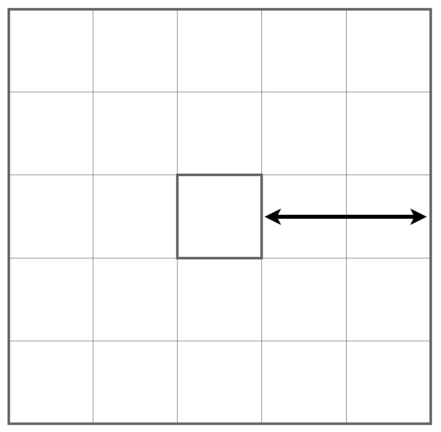

# Notes regarding lab format


We will use Matlab Livescript for this lab. Livescript allows switching between text and code cells. 


You will find the entire lab manual in this file. Some exercises require you to write a text answer, others require you to write code. You should not define functions inside this file. Instead save functions to the functions folder and call them from the code cells in this notebook.


Your finished lab report should be a .zip-file containing your functions folder, and this livescript file. You should also provide a pdf of the result of running the live script (in the Live Editor, you can **export to pdf** under Save).


Since we need to access the functions and data folder the first step is to add the following locations to MATLAB's path.


```matlab:Code
addpath('./functions');
addpath('./data');
```

# Lab 1: The SIFT descriptor


In this lab you will implement a SIFT-like descriptor and try it on some classification tasks. Keep your code well commented, both for your own sake and because it is required.


# Ex 1.1


Make a function


    patch = get_patch(image, x, y, patch_radius)


that takes out a square patch from the image centred at (x; y) with a range of +/- patch_radius. (The figure below shows a patch with patch_radius of two pixels.) Make sure that your function works both for grayscale and color images.


\matlabheading{}
# Ex 1.2 


Use


```matlab:Code
test_image = reshape((11:120), 10, 11)
```


```text:Output
test_image = 10x11    
    11    21    31    41    51    61    71    81    91   101   111
    12    22    32    42    52    62    72    82    92   102   112
    13    23    33    43    53    63    73    83    93   103   113
    14    24    34    44    54    64    74    84    94   104   114
    15    25    35    45    55    65    75    85    95   105   115
    16    26    36    46    56    66    76    86    96   106   116
    17    27    37    47    57    67    77    87    97   107   117
    18    28    38    48    58    68    78    88    98   108   118
    19    29    39    49    59    69    79    89    99   109   119
    20    30    40    50    60    70    80    90   100   110   120

```


to create a test image with numbered pixels. Try extracting a few patches from this image to verify that your function works. Make sure that the x-variable corresponds to the column index and the y-variable to the row index.


```matlab:Code
get_patch(test_image,3,4,2)
```


```text:Output
ans = 5x5    
    12    22    32    42    52
    13    23    33    43    53
    14    24    34    44    54
    15    25    35    45    55
    16    26    36    46    56

```

# Ex 1.3


Modify **get_patch** so it returns an error with an informative error message such as


    'Patch outside image border'


if the patch doesn't fit inside the image. Use the error function for this. Test with the following.


```matlab:Code
get_patch(test_image,2,4,2)
```


```text:Output
Error using get_patch
Patch outside image border
```

# Gradient histograms
# Ex 1.4


Create a Matlab function **gaussian_filter** that takes two arguments, one grayscale image and one number specifying a standard deviation. The output should be the image filtered with a Gaussian filter of the specified standard deviation. Example usage:


```matlab:Code
img = rgb2gray(imread('paper_with_digits.png'));
img = double(img); %convert from integer format to doubles
result = gaussian_filter(img, 5.0);
figure; imagesc(img); axis image; colormap gray;
figure; imagesc(result); axis image; colormap gray;
```


The filter size should be at least four standard deviations not to loose precision. Use **fspecial** to construct a Gaussian filter. It is a good idea to use the **'symmetric'** option with **imfilter**. (Do not use the built-in function for Gaussian filtering.)


# Ex 1.5


Make a function


        [grad_x, grad_y] = gaussian_gradients(img, std)


that takes a grayscale image and estimates both gaussian derivatives for each pixel. Use filtering with derivative filters and your function from the previous exercise. The output should be two matrices of same size as the input image. Be careful about the definition of x and y.


# Ex 1.6


Plot your gradients in the image using


```matlab:Code
smallimg = img(70:250,1050:1280);
[grad_x, grad_y] = gaussian_gradients(smallimg, 5);
clf
imagesc(smallimg)
axis image
hold on
quiver(grad_x, grad_y)
```


```matlab:Code
clf
imagesc(smallimg(50:80,50:80))
axis image
hold on
quiver(grad_x(50:80,50:80), grad_y(50:80,50:80))
```


and verify visually that the gradients are correct.


# Ex 1.7 


Make a function


    histogram = gradient_histogram(grad_x, grad_y)


that places each gradient into one of eight orientation bins. A useful function is **atan2** in Matlab. Use the bins and bin order from the lecture notes. The provided **plot_bouquet** lets you plot the histograms as a bouquet of vectors and might be helpful for debugging. It assumes that you have given all functions exactly the names suggested here and used the bin ordering from the lecture notes.


```matlab:Code
plot_bouquet (smallimg(1:40,:), 5);
```


```matlab:Code
plot_bouquet (img, 5);
```


# A SIFT-like descriptor


Next, we will create a SIFT-like descriptor by computing gradient histograms for 3 x 3 regions and stacking them into a vector. The exact positions and sizes of the regions are not crucial. For example, you might choose whether to use overlapping regions or not. The figure below shows an example of how to place the nine regions. You can use the provided **paper_with_digits.png** as an example image. For example, there is a digit at (1290; 950).


> Figure: Example of patch placement. The x marks the coordinates in the argument position.


# Ex 1.8


Make a function


    region_centres = **place_regions(centre, radius)**


that creates 3 x 3 square regions for the descriptor; see the above figure. The input radius specifies the radius of each square region (as in Ex 1.1). The output should be an 2x9 array with columns being the 2D centre points of the 9 regions. Use the provided function


    **plot_squares(img, region_centres, region_radius)**


to plot your regions in an example image. Increasing the input radius with a factor K should scale the whole region pattern with a factor K.


```matlab:Code
centre = [1290;950]; radius = 40;
region_centres = place_regions(centre, radius);
plot_squares(img, region_centres, radius);
```


# Ex 1.9 


Make a function


        desc = gradient_descriptor(image, position, radius)


that computes a SIFT-like descriptor at a certain position. The input radius controls the size of the regions just as in Ex 1.8.


    - Compute gaussian gradients. Let the standard deviation be proportional to radius.


    - Divide your gradients into 3 x 3 regions defined by **place_regions**.


    - Compute a gradient histogram for the gradients from each region.


    - Stack the histograms into a 72-vector.


    - Normalize that vector to unit length.


# Digit classification


In the file **digits.mat**, there are two lists of images, **digits_training** with 100 training images and **digits_validation** with 50 similar images. Our next goal is to classify each of the validation images by finding the most similar image in the training set and assuming that the query image has the same label.


Load the digit data by running


```matlab:Code
load digits.mat
```


The examples are stored in a struct array. To get image number 12 you write **digits_training(12).image **and to get its label you write **digits_training(12).label **.


# `Ex 1.10`


Make a script **prepare_digits.m** that computes a descriptor for each digit in **digits_training**. You need to choose the position and radius parameters so that all the descriptor regions fit into the images. Store the descriptors in an appropriate place. A suggestion is to store the 12th descriptor in **digits_training(12).descriptor**.


```matlab:Code
prepare_digits;
%show 12th digit and its fields - there should be 'image', 'label' and 'descriptors'
digits_training(12)
```


```text:Output
ans = 
         image: [39x39 double]
         label: 2
    descriptor: [72x1 double]

```


**Ex 1.11**


Make a function


    label = classify_digit(digit_image, digits_training)


that computes a descriptor for the given digit image, goes through all the digits in **digits_training** to find the one with the most similar descriptor and outputs the label of that digit.


You can use **disp** to display text in matlab. For example


    disp(['I am ' num2str(age) ' years old'])


will display your age, assuming that it is stored in the variable** age**.


# Ex 1.12


Make a script **classify_all_digits.m** that runs **classify_digit** for each of the digits in **digits_validation **and displays the percentage of correct answers.


```matlab:Code
classify_all_digits
```


```text:Output
Accuracy 82%
```

# Ex 1.13


Try to classify a few of the large digits in **paper_with_digits.png**. For example there are digits at


> [1290; 950] ; [820; 875] ; [220; 570] ; [170; 330]


Note that you need to change the radius parameter. For each digit, plot the appropriately sized grid of regions and print the digit it was classified as.


```matlab:Code
%Your code here
digits_positions = [[1290; 950] , [820; 875] , [220; 570] , [170; 330]];
radii = [30; 30; 25; 20];
for i=1:4
    centers = place_regions(digits_positions(:,i),radii(i));
    figure, plot_squares(img, centers, radii(i));
    label = classify_digit(img, digits_positions(:,i), radii(i), digits_training);
    disp(['Predicted: ', num2str(label)])
end
```


```text:Output
Predicted: 2
```


```text:Output
Predicted: 4
```


```text:Output
Predicted: 3
```


```text:Output
Predicted: 9
```


Describe any one idea on how to set the radius parameter automatically?


**Your answer**: 


Some approach might be:


   1.  We could use a scale-space method to determine the radius based on the local scale of the image features 
   1.  Use some machine learning techniques, e.g. train a neural network that predicts the radius for a given image 

# Using the SIFT code from Computer Vision toolbox


To speed things up a bit, we will use the SIFT descriptor from the CV toolbox in the next few exercises.


It is written in C, so it is much more efficient than your Matlab implementation. Use


                     points = detectSIFTFeatures(img);


                    [features, validPoints] = extractFeatures(img,points);


to compute positions and descriptors for the SIFT features in an image.


# Ex 1.14 


To prepare for the next exercise, try to work out how to use the built-in function **matchFeatures**. To match descriptors using the Lowe criterion with threshold 0.7, add the following options:


    corrs = matchFeatures(descs_1, descs_2, 'MatchThreshold', 100, 'MaxRatio', 0.7);


# Ex 1.15


In **church_data_matlab.mat** there is a collection of stored feature points, **feature_collection**. This is a struct with a 128 x N-array **feature_collection.descriptors** containing descriptors and a 1 x N array of labels **feature_collection.labels**


```matlab:Code
load church_data_matlab.mat
feature_collection
```


```text:Output
feature_collection = 
          names: {'goteborg'  'kalmar'  'lund'  'stockholm'  'uppsala'}
    descriptors: [128x16645 single]
         labels: [1 1 1 1 1 1 1 1 1 1 1 1 1 1 1 1 1 1 1 1 1 1 1 1 1 1 1 1 1 1 1 1 1 1 1 1 1 1 1 1 1 1 1 1 1 1 1 1 1 1 1 1 1 1 1 1 1 1 1 1 1 1 1 1 1 1 1 1 1 1 1 1 1 1 1 1 1 1 1 1 1 1 1 1 1 1 1 1 1 1 1 1 1 1 1 1 1 1 1 1 1 1 1 1 1 1 1 1 1 1 1 1 1 1 1 1 … ]

```


```matlab:Code
feature_collection.labels
```


```text:Output
ans = 1x16645    
     1     1     1     1     1     1     1     1     1     1     1     1     1     1     1     1     1     1     1     1     1     1     1     1     1     1     1     1     1     1     1     1     1     1     1     1     1     1     1     1     1     1     1     1     1     1     1     1     1     1

```


The labels indicate what church the feature was collected from. The link between labels and church names is given by **feature_collection.names**.


Make a function


    label = classify_church(image, feature_collection)


that tries to classify a new image by computing feature points for the new image, matching them to the features in the list and letting each match vote for the correct church.


Try classifying all ten provided church images in **church_test**. How many do you get right? (Note: It should be possible to get all of them right!) The correct labels are stored in **manual_labels.mat**.


```matlab:Code
load church_test/manual_labels.mat;
correct = 0;
for church = 1:10
    im = rgb2gray(imread(['church_test/church',num2str(church),'.jpg']));
    label = classify_church(im, feature_collection);
    disp(['Church is ' manual_labels{church} ' and classified as ' feature_collection.names{label}]);
    correct = correct + strcmp(feature_collection.names{label},manual_labels{church});
end
```


```text:Output
Church is goteborg and classified as goteborg
Church is kalmar and classified as kalmar
Church is stockholm and classified as stockholm
Church is kalmar and classified as kalmar
Church is uppsala and classified as uppsala
Church is uppsala and classified as uppsala
Church is goteborg and classified as goteborg
Church is lund and classified as lund
Church is lund and classified as lund
Church is stockholm and classified as stockholm
```


```matlab:Code
disp(['Correctly classified churches: ',num2str(correct)]);
```


```text:Output
Correctly classified churches: 10
```


    


