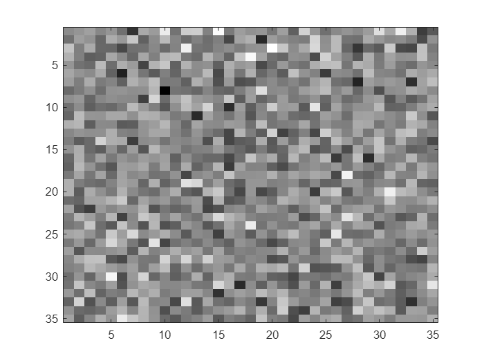
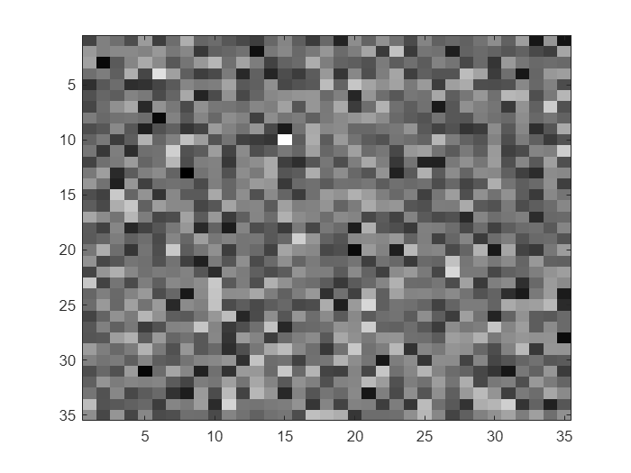
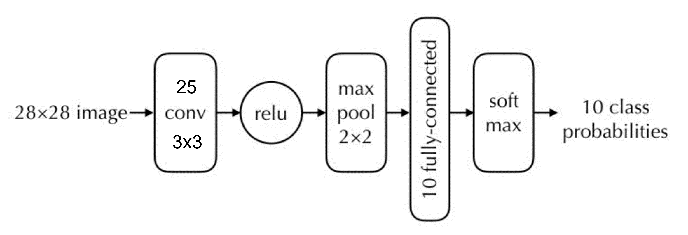

# Table of contents
- [Ex 2.1 ](#ex-21)
- [Ex 2.2 ](#ex-22)
- [Ex 2.3](#ex-23)
- [Ex 2.4](#ex-24)
- [Ex 2.5](#ex-25)
- [Ex 2.6 ](#ex-26)
- [Ex 2.7](#ex-27)
- [Ex 2.8 ](#ex-28)
- [Ex 2.9](#ex-2.9)
- [Ex 2.11 ](#ex-211)
- [Ex 2.12 ](#ex-212)
- [Ex 2.13 ](#ex-213)
- [Ex 2.14 ](#ex-214)
- [Ex 2.15 ](#ex-215)
- [Ex 2.17](#ex-217)
- [Ex 2.18](#ex-218)
- [Ex 2.19 ](#ex-219)
- [Ex 2.20](#ex-220)


# Notes regarding lab format


We will use Matlab Livescript for this lab. Livescript allows switching between text and code cells. 


You will find the entire lab manual in this file. Some exercises require you to write a text answer, others require you to write code. You should not define functions inside this file. Instead save functions to the functions folder and call them from the code cells in this notebook.


Your finished lab report should be a .zip-file containing the data folder, your functions folder, any output images you might have saved and this livescript file.


Since we need to access the functions and data folder the first step is to add these two locations to MATLAB's path.


```matlab:Code
addpath('./functions');
addpath('./data');
```

# Lab 2: Learning and convolutional neural networks
# 2.1 Learning a Linear Classifier


In this part, we will try to learn a linear classifier for blood cell detection. Note that the classifier could also be viewed as a minimal neural network consisting of three parts: a scalar product node (or fully-connected node), a constant (or bias) term and a logistic sigmoid function. To find good parameters we will try to minimize the negative log-likelihood over a small training set.


The output from our classifier is a probability p for the input patch being centered at a cell centre. The sigmoid function will make sure that 0 ≤ p ≤ 1. To be more precise the output is


$$
p=\frac{e^y }{1+e^y }\;\;\;\;\textrm{where}\;\;\;\;y=I\cdot \omega +\omega_0
$$


Instead of testing a bunch of manually chosen w’s and w_0’s, we will try to learn good values for all the parameters. This requires training examples, that you find in cell_data.mat.


# Ex 2.1
# Load the data using

```matlab:Code
load cell_data.mat
```


It loads a structure, cell_data, with two fields, `fg_patches` and `bg_patches`, corresponding to positive (centered blood cells) negative examples respectively.


# Ex 2.2 


Create two new variables, examples and labels. The variable examples should be a cell structure containing all the patches (both positives and negatives) and labels should be an array with the same number of elements such that `labels(i) = 1` if` examples{i}` is a positive example, and `labels(i) = 0` otherwise.


```matlab:Code
% Your code here
examples = [cell_data.fg_patches, cell_data.bg_patches];
labels = [zeros(1, size(cell_data.fg_patches,2)), ones(1, size(cell_data.bg_patches,2))];
```

# Ex 2.3


Split the data into training,` (examples_train, labels_train)`, and validation,` (examples_val, labels_val)`. The two should have a similar structure to examples and labels. Write on the report which percentage of the data you used for validation. Also, the splitting of the data into the two sets should be done in a random manner, for example, using randperm. 


**Percentage of data used for training**: 80%


**Percentage of data used for validation**: 20%


```matlab:Code
% Your code here
split_perc = 0.8;
N = size(examples,2);

train_size = round(N*split_perc);
val_size = N - train_size;

indexes = randperm(N);

examples_train = examples(indexes(1:train_size));
labels_train = labels(indexes(1:train_size));

examples_val = examples(indexes(train_size+1:end));
labels_val = labels(indexes(train_size+1:end));
```

# 2.2 Training the classifier


We will try to find parameters that minimize the negative log-likelihood on the training data. More precisely,


$$
L\left(\theta \right)=\sum_{i\in S_+ } -\ln \left(p_i \right)+\sum_{i\in S_- } -\ln \left(1-p_i \right)=\sum_i L_i \left(\theta \right)
$$


where $p_i$ refers to the classifier output for the ith training example. As in the lectures we will refer to the terms here as the partial loss $L_i$.


Before doing the next exercise, you need to work out how to compute the gradient of the partial loss $L_i$.


# Ex 2.4


Make a function


        `[wgrad, w0grad] = partial_gradient(w, w0, example_train, label_train)`


that computes the derivatives of the partial loss L_i with respect to each of the classifier parameters. Let the output wgrad be an array of the same size as the weight image, w (and let w0grad be a number). 


At each iteration of stochastic gradient descent, a training example, i, is chosen at random. For this example the gradient of the partial loss, L_i , is computed and the parameters are updated according to this gradient. The most common way to introduce the randomness is to make a random reordering of the data and then going through it in the new order. One pass through the data is called an epoch.


# Ex 2.5


Make a function


        `[w, w0] = process_epoch(w, w0, lrate, examples_train, labels_train)`


that performs one epoch of stochastic gradient descent


# Ex 2.6 


Initialize \texttt{w = s * randn(35,35);}, with `s = 0.01` and `w0 = 0;` and run 5 epochs on your training examples. Plot w after each epoch (or after each iteration if you are curious), to get a sense of what is happening. Also, try using different `s={10,1,0.1,0.01}` and plot w after 5 epochs for each value of s. Include on the report visualizations of w for the different values of s, along with an written explanation of what is happening.


```matlab:Code
% your code here
s={10,1,0.1,0.01};
for i=1:length(s)

    w = s{i} * randn(35,35);
    w0 = 0;
    n_epochs = 5;
    lrate = 0.1;
    disp(['S: ', num2str(s{i})])
    disp(['Epoch: 0'])
    figure
    imagesc(w)
    colormap gray

    for j=1:n_epochs
    
        [w,w0] = process_epoch(w,w0,lrate,examples_train,labels_train);
    
    end
    disp('Epoch 5')
    figure
    imagesc(w)
    colormap gray
end
```


```text:Output
S: 10
Epoch: 0
```


```text:Output
Epoch 5
```


```text:Output
S: 1
Epoch: 0
```





```text:Output
Epoch 5
```


```text:Output
S: 0.1
Epoch: 0
```


```text:Output
Epoch 5
```


```text:Output
S: 0.01
Epoch: 0
```


```text:Output
Epoch 5
```


**Your written answer here:**


Firstly, we can see that the gradient is changing with the number of epochs, indicating that the gradient is actually updating it. Now, if we consider the initialization of w, which is a random process, we can se that the initial situation of the matrix actually influences the "learning" of the classifier. We can actually see how multiplying the initial w matrix by a scalar, namely s, affects the training. As previously stated the training (the stochastic descent) depends on the gradient and and therefore also the subsequent updating of the weighting matrix.


# Ex 2.7


As said before, at each iteration of stochastic gradient descent, a training example is chosen at random. Check what happens to w after 5 epochs when that training example is not chosen randomly but in sequence, i.e. first `i = 1`, then `i = 2`, and so on. Include on the report a visualization of w for this case. (Don’t forget to change back your function to a random choice of i after this exercise).


You can display the resulting filters inside this livescript notebook using the function imagesc.


```matlab:Code
% Your code here
s={10,1,0.1,0.01};
for i=1:length(s)

    w = s{i} * randn(35,35);
    w0 = 0;
    n_epochs = 5;
    lrate = 0.1;
    disp(['S: ', num2str(s{i})])
    disp(['Epoch: 0'])
    figure
    imagesc(w)
    colormap gray

    for j=1:n_epochs
    
        [w,w0] = process_epoch(w,w0,lrate,examples_train,labels_train);
    
    end
    disp('Epoch 5')
    figure
    imagesc(w)
    colormap gray
end
```


```text:Output
S: 10
Epoch: 0
```


```text:Output
Epoch 5
```


```text:Output
S: 1
Epoch: 0
```





```text:Output
Epoch 5
```


```text:Output
S: 0.1
Epoch: 0
```


```text:Output
Epoch 5
```


```text:Output
S: 0.01
Epoch: 0
```


```text:Output
Epoch 5
```


# Ex 2.8 


Make a function


        `predicted_labels = classify(examples_val,w,w0);`


that applies the classifier to the example data. After that, use it on `examples_train` and examples_val and check how much accuracy it gets for each by comparing the predicted labels with `labels_train` and `labels_val` respectively. Write on your report the highest accuracy you were able to achieve in the training and validation data. Hint: train the classifier for longer than 5 epochs to make sure that it converges.


When you have defined the function run the following code.


```matlab:Code
s = 0.001;
w = s * randn(35,35);
w0 = 0;
n_epochs = 500;
lrate = 0.01;

for i=1:n_epochs

    [w,w0] = process_epoch(w,w0,lrate,examples_train,labels_train);

end

predicted_labels = classify(examples_val,w,w0);
correct = sum(predicted_labels==labels_val);
accuracy = 100*correct/length(labels_val);
fprintf(["Validation Accuracy: "]+accuracy+["%%"])
```


```text:Output
Validation Accuracy: 90%
```


**Write the highest accuracy you were able to get here:**


90%


# Ex 2.9


The data for training this classifier consists on only 400 examples (less if you consider that you have split it into training and validation). To achieve higher accuracy it might be useful to perform some data augmentation before the training. In this exercise you will increase the number of elements in the training examples by M times. Make a function


        `[examples_train_aug,labels_train_aug] = augment_data(examples_train,labels_train,M)`


that takes each sample of the original training data and applies M random rotations (you can use Matlab function imrotate), from which result M new examples. Store these new examples in examples_train_aug and their corresponding labels in labels_train_aug. Train the classifier with this augmented data and write on your report the new values for accuracy on the training and validation examples.


```matlab:Code
% Your code here
s = 0.001;
w = s * randn(35,35);
w0 = 0;
n_epochs = 500;
lrate = 0.01;
M = 3;
[examples_train_aug,labels_train_aug] = augment_data(examples_train,labels_train,M);

for i=1:n_epochs

    [w,w0] = process_epoch(w,w0,lrate,examples_train_aug,labels_train_aug);

end

predicted_labels = classify(examples_val,w,w0);
correct = sum(predicted_labels==labels_val);
accuracy = 100*correct/length(labels_val);
fprintf(["Validation Accuracy: "]+accuracy+["%%"])
```


```text:Output
Validation Accuracy: 95%
```

  


**Write the highest accuracy you were able to get here:**


95%


# 2.3 Convolutional neural networks


In the last part, your task is to train convolutional neural networks using Matlab.


# `Ex 2.10 `


Run the following cell


```matlab:Code
[imgs, labels] = digitTrain4DArrayData;
```


to load a dataset of images of digits into Matlab. (Make sure you have the Deep Learning toolbox installed). You will find the 5000 digit images in imgs. Plot a few of them to see what the data looks like.


```matlab:Code
N = 3210; % We have 5000 images so any number between 1 and 5000 works.
img = imgs(:,:,:,N);
imagesc(img), axis image, colormap gray
```


    The next step is to define a network for classification. In Matlab, you do this by simply giving an array of the layers. For example, this would be a linear classifier similar to the one you trained for cells:


        layers = [


            imageInputLayer([35 35 1]);


            fullyConnectedLayer(1);


            softmaxLayer();


            classificationLayer()];


# Ex 2.11 


Make a function


        `layers = basic_cnn_classifier()`


that implements the following network in Matlab:





Apart from the layers above the functions `convolution2dLayer`, `reluLayer` and `maxPooling2dLayer` will be useful. Note that you have to set the *stride* for max pooling to 2 to get the expected downsampling.


When you have written the function run the following cell:


```matlab:Code
layers = basic_cnn_classifier()
```


```text:Output
layers = 
  7x1 Layer array with layers:

     1   ''   Image Input             28x28x1 images with 'zerocenter' normalization
     2   ''   2-D Convolution         25 3x3 convolutions with stride [1  1] and padding [0  0  0  0]
     3   ''   ReLU                    ReLU
     4   ''   2-D Max Pooling         2x2 max pooling with stride [2  2] and padding [0  0  0  0]
     5   ''   Fully Connected         10 fully connected layer
     6   ''   Softmax                 softmax
     7   ''   Classification Output   crossentropyex
```

# Ex 2.12 


Create a set of training options telling Matlab to use stochastic gradient descent with momentum (SGDM), for the optimization:


        `options = trainingOptions('sgdm');`


Now train the network (using default parameters) by running


        net = trainNetwork(imgs, labels, layers, options)


```matlab:Code
% Your code here
options = trainingOptions('sgdm', "ExecutionEnvironment","gpu");
net = trainNetwork(imgs,labels, layers, options);
```


```text:Output
Initializing input data normalization.
|========================================================================================|
|  Epoch  |  Iteration  |  Time Elapsed  |  Mini-batch  |  Mini-batch  |  Base Learning  |
|         |             |   (hh:mm:ss)   |   Accuracy   |     Loss     |      Rate       |
|========================================================================================|
|       1 |           1 |       00:00:05 |        9.38% |       2.3139 |          0.0100 |
|       2 |          50 |       00:00:07 |       51.56% |       1.7514 |          0.0100 |
|       3 |         100 |       00:00:09 |       60.16% |       1.3093 |          0.0100 |
|       4 |         150 |       00:00:11 |       64.06% |       1.0682 |          0.0100 |
|       6 |         200 |       00:00:13 |       60.16% |       1.1575 |          0.0100 |
|       7 |         250 |       00:00:15 |       61.72% |       1.1276 |          0.0100 |
|       8 |         300 |       00:00:18 |       66.41% |       0.9876 |          0.0100 |
|       9 |         350 |       00:00:20 |       78.12% |       0.7456 |          0.0100 |
|      11 |         400 |       00:00:22 |       79.69% |       0.6618 |          0.0100 |
|      12 |         450 |       00:00:24 |       74.22% |       0.7351 |          0.0100 |
|      13 |         500 |       00:00:26 |       82.03% |       0.6850 |          0.0100 |
|      15 |         550 |       00:00:29 |       81.25% |       0.6073 |          0.0100 |
|      16 |         600 |       00:00:31 |       84.38% |       0.5670 |          0.0100 |
|      17 |         650 |       00:00:33 |       92.19% |       0.3946 |          0.0100 |
|      18 |         700 |       00:00:35 |       93.75% |       0.3313 |          0.0100 |
|      20 |         750 |       00:00:37 |       89.06% |       0.3811 |          0.0100 |
|      21 |         800 |       00:00:39 |       92.19% |       0.3290 |          0.0100 |
|      22 |         850 |       00:00:41 |       93.75% |       0.2875 |          0.0100 |
|      24 |         900 |       00:00:44 |       96.88% |       0.1981 |          0.0100 |
|      25 |         950 |       00:00:46 |       95.31% |       0.2410 |          0.0100 |
|      26 |        1000 |       00:00:48 |       96.09% |       0.1925 |          0.0100 |
|      27 |        1050 |       00:00:50 |       94.53% |       0.2027 |          0.0100 |
|      29 |        1100 |       00:00:53 |       98.44% |       0.1713 |          0.0100 |
|      30 |        1150 |       00:00:55 |       96.88% |       0.1526 |          0.0100 |
|      30 |        1170 |       00:00:56 |       98.44% |       0.1516 |          0.0100 |
|========================================================================================|
Training finished: Max epochs completed.
```

# Ex 2.13 


Try the network on a few of the training images. You can use `net.predict(img)` to get the ten output probabilities or `net.classify(img)` to get the most probable class.


```matlab:Code
% Your code here
N = randi(5000);
img = imgs(:,:,:,N);
imagesc(img), axis image, colormap gray
```


```matlab:Code
net.predict(img)
```


```text:Output
ans = 1x10 single row vector    
    0.0001    0.0000    0.0035    0.8378    0.0000    0.1452    0.0001    0.0044    0.0063    0.0026

```


```matlab:Code
net.classify(img)
```


```text:Output
ans = 
     3 

```

# Ex 2.14 


Work out how many trainable parameters your network contains. Include the answer in your submission. If you explore what the data structure net actually contains, you can find the answer there as well. Note that the convolution layer does not use padding so the output from the convolution layer is smaller than the input.


**Write your answer here:**


The input layer obviousely has no parameters. 


For the Conv layer we have 1 input channel and 25 output channels, this means that we have (3*3+1)*25 = 250 parameters. The output has size (26x26x25)


The MaxPool layer does not have any parameters but reduces the size of the input, the output size is (13x13x25).


For the FC layer, the previous layer is flattened so its input shape is (13*13*25)x1= 4225x1. Since the output shape is (10x1) we have that the layer has (4225*10+10) = 42260 parameters.


In total the model has: 44510 


# Ex 2.15 


Matlab prints a lot of output, for example the accuracy on the training set. Recall from the lectures that this number is not very good for judging the quality of a classifier. Instead we should save a subset of the data as a validation set, that we can use to evaluate the trained network. 


Divide the data into training `imgs` and `labels` into new variables `imgs_train, labels_train, imgs_val, labels_val`.


```matlab:Code
% Your code here
split_perc = 0.8;
N = length(imgs);
train_size = round(split_perc*N);
test_size = N - train_size;
imgs_train = imgs(:,:,:,1:train_size);
labels_train = labels(1:train_size);
imgs_val = imgs(:,:,:,train_size+1:end);
labels_val = labels(train_size+1:end);
```


Make a function 


        `net = train_classifier(layers, imgs_train, labels_train, imgs_val, labels_val) `


that runs a few epochs of training and then evaluates the accuracy on the validation set. In this case, Matlab has given us a separate test set, so we don’t have to save images for that purpose. *Matlab hints:* You can run multiple images at once by stacking them along the fourth dimension. If you want to continue training the same network you can run


        `net = train_classifier(net.Layers, imgs_train, labels_train, imgs_val, labels_val)`


```matlab:Code
% Your code here
 net = train_classifier(net.Layers, imgs_train, labels_train, imgs_val, labels_val)
```


```text:Output
Training the network
The network achieved an accuracy of: 98.5%
net = 
  SeriesNetwork with properties:

         Layers: [7x1 nnet.cnn.layer.Layer]
     InputNames: {'imageinput'}
    OutputNames: {'classoutput'}

```


**Ex 2.16 **


To run a convolutional neural network we have to perform a massive amount of computations. Hence it is very important to consider the computational load when designing a network. For the network below, compare (roughly) the time consumption of the blue and the red layers. You can ignore effects of padding. Include your answer and your motivation in your submission.


**Write your answer here:**


If we try to compute the parameters of the blue layer we find that it has (10*5*5+1)*10=2510 parametrs.


For the red layer we are going to have (5*5*10+1)*20=5020.


This means that the red layer has double the parameters of the blue layer. However, between the blue and the red layers there are 2 max pool layers and a convolutional layer. This means that the input size of the red layer is going to be much smaller than the input size of the blue one. This means that (depending on parameters like the stride) the number of computations might be similar. Hence they could have a roughly similar time consumption. 


NOTE: You are not supposed to actually implement and train this network.


# Ex 2.17


Replace the blue box of the network in the figure above by a sequence of two layers of 10 3 × 3 convolutional filters. What changes in terms of network parameters, time consumption and accuracy? Again, you are not supposed to implement the network.


**Write your answer here:**


As stated above the blue layer has 2510 parametrs, if we substitute it with two 10 3x3 conv layers we are going to have 2*(3*3*10+1)*10 = 1820. This means that we are going to have less parameters and the network would get simplier. Moreover, the weight matrix are going to be considerably smaller meaning that there are going to be less operations carried out. Regarding accuracy, the model it's going to get deeper which is going to improve the overall accuracy of the model.


# Ex 2.18


Make a copy of basic_cnn_classifier.m and name it better_cnn_classifier.m. Try modifying the network by adding more layers. Also experiment with the training options. How much can you improve the results?


```matlab:Code
% Your code here
layers = better_cnn_classifier()
```


```text:Output
layers = 
  11x1 Layer array with layers:

     1   ''   Image Input             28x28x1 images with 'zerocenter' normalization
     2   ''   2-D Convolution         25 3x3 convolutions with stride [1  1] and padding [0  0  0  0]
     3   ''   ReLU                    ReLU
     4   ''   2-D Max Pooling         2x2 max pooling with stride [2  2] and padding [0  0  0  0]
     5   ''   2-D Convolution         20 5x5 convolutions with stride [1  1] and padding [0  0  0  0]
     6   ''   ReLU                    ReLU
     7   ''   2-D Max Pooling         2x2 max pooling with stride [2  2] and padding [0  0  0  0]
     8   ''   Fully Connected         50 fully connected layer
     9   ''   Fully Connected         10 fully connected layer
    10   ''   Softmax                 softmax
    11   ''   Classification Output   crossentropyex
```


```matlab:Code
net = train_classifier(layers, imgs_train, labels_train, imgs_val, labels_val)
```


```text:Output
Training the network
The network achieved an accuracy of: 98.8%
net = 
  SeriesNetwork with properties:

         Layers: [11x1 nnet.cnn.layer.Layer]
     InputNames: {'imageinput'}
    OutputNames: {'classoutput'}

```

# Ex 2.19 


Load the builtin test images using


        `[imgs_test, labels_test] = digitTest4DArrayData;`


Run the network on all the test images. You apply the network to an image using


        pred = net.classify(image)


Compute precision and recall for each of the 10 classes and include these in your submission. The definitions of precision and recall can be found in the lecture notes chapter 4.


```matlab:Code
%Your code here
[imgs_test, labels_test] = digitTest4DArrayData;
preds = net.classify(imgs_test);

for c=0:9

    class = num2str(c);
    idx = find(labels_test==class);
    tp = nnz(preds(idx)==class);
    precision = tp/nnz(preds==class);
    recall = tp/length(idx);

    disp(class)
    disp(['Precision: ',num2str(precision)])
    disp(['Recall: ', num2str(recall)])

end
```


```text:Output
0
Precision: 0.98614
Recall: 0.996
1
Precision: 0.99795
Recall: 0.972
2
Precision: 0.97446
Recall: 0.992
3
Precision: 0.99192
Recall: 0.982
4
Precision: 0.99404
Recall: 1
5
Precision: 0.98998
Recall: 0.988
6
Precision: 0.99195
Recall: 0.986
7
Precision: 0.98802
Recall: 0.99
8
Precision: 0.97652
Recall: 0.998
9
Precision: 1
Recall: 0.986
```

# Ex 2.20


Save three of the failure cases with names indicating what digit they were mistaken for. Include these in your submission. You can use imwrite(img, ’mistaken_as_5.png’) to save an image if it is correctly scaled. Have a look at the file before submitting it, so it looks right.


You can load and display the images here using imagesc:


```matlab:Code
% Your code here
n_fails = 3;
fail = find(preds ~= labels_test);
idx = randperm(length(fail),n_fails);
fail_idx = fail(idx);
for i=1:n_fails
    
    real_label = labels_test(fail_idx(i));
    predicted_label = preds(fail_idx(i));
    img = imgs_test(:,:,:,fail_idx(i));

    disp(['Real label: ' real_label])
    disp(['Predicted label: ' predicted_label])
    figure,imagesc(img),colormap gray
    img_name = strcat('./data/',string(real_label), '_mistaken_as_', string(predicted_label),'.png');
    imwrite(img, img_name);

end
```


```text:Output
     Real label:      3 
     Predicted label:      8 
```


```text:Output
     Real label:      6 
     Predicted label:      5 
```


```text:Output
     Real label:      2 
     Predicted label:      0 
```


