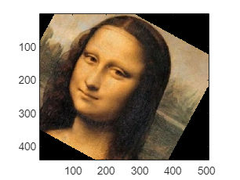
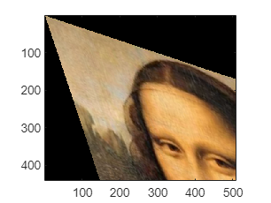
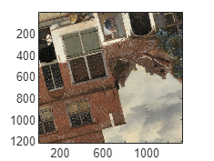
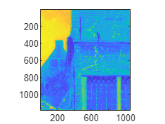
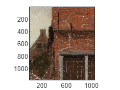
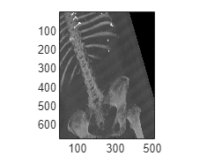
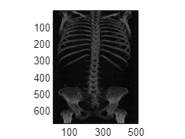
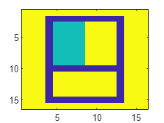
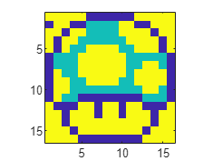
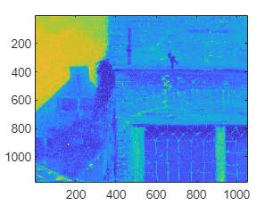

# Table of contents
- [Ex 3.1 Getting started](#ex-3.1-getting-started)
- [Ex 3.2 Minimum correspondences](#ex-3.2-minimum-correspondences)
- [Ex 3.3 Trying warping](#ex-3.3-trying-warping)
- [Ex 3.4 Writing test case](#ex-3.4-writing-test-case)
- [Ex 3.5 Writing a minimal solver](#ex-3.5-writing-a-minimal-solver)
- [Ex 3.6 Computing residuals](#ex-3.6-computing-residuals)
- [Ex 3.9 Aligning images](#ex-3.9-aligning-images)
- [Ex 3.10 Aligning images with known orientation](#ex-3.10-aligning-images-with-known-orientation)
- [Ex 3.11 Flouroscent image example (optional)](#ex-3.11-flouroscent-image-example-(optional))
- [Ex 3.12 Get pixel value](#ex-3.12-get-pixel-value)
- [Ex 3.13 Warp](#ex-3.13-warp)
- [Ex 3.14 LS](#ex-3.14-ls)


# Notes regarding lab format


We will use Matlab Livescript for this lab. Livescript allows switching between text and code cells. 


You will find the entire lab manual in this file. Some exercises require you to write a text answer, others require you to write code. You should not define functions inside this file. Instead save functions to the functions folder and call them from the code cells in this notebook.


Your finished lab report should be a .zip-file containing the data folder, your functions folder and this livescript file. As usual, you should also provide a pdf of the result of running the live script (in the Live Editor, you can **export to pdf** under Save) where all result images should be visible.


In certain sections of this lab, MATLAB might throw warnings about conditioning of matrices. You should turn them off using the command  **`warning('off','all')`** and submit the final pdf withput these warnings displayed.** **


Since we need to access the functions and data folder the first step is to add these two locations MATLAB's path.


```matlab:Code
addpath('./functions');
addpath('./data');
```

# Lab 3: Image Registration


An affine transformation is written as:


$$
\left(\begin{array}{l}
\tilde{x} \\
\tilde{y} 
\end{array}\right)=\left(\begin{array}{ll}
a & b\\
c & d
\end{array}\right)\left(\begin{array}{l}
x\\
y
\end{array}\right)+\left(\begin{array}{l}
t_x \\
t_y 
\end{array}\right)=A\left(\begin{array}{l}
x\\
y
\end{array}\right)+t
$$


Apart from rotation, translation and scaling, it also allows stretching the image in an arbitrary dimension. 


# Ex 3.1 Getting started


Any matrix $A$ can be written as $A=U\Sigma V^T$, a so-called Singular Value Decomposition, where $U,V$are orthogonal matrices and $\Sigma =\left\lbrack \begin{array}{cc}
\lambda_1  & 0\\
0 & \lambda_2 
\end{array}\right\rbrack$is a diagonal matrix with $\lambda_1 ,\lambda_2$ non-negative. Using this decomposition, describe what an affine transformation actually does when applied to an image. If one would like to stretch the image along the x-axis, one simply applies A=diag([k,1]) for some stretching factor k. How should one obtain a stretching with a factor k along the diagonal direction of an image with an affine transformation? Note, A=diag([k,k]) would give a uniform stretching of the image.


**Your answer here with explanation as a comment here.	**


```matlab:Code
%%
% We start by defining what an affine transformation does.
% An affine transformation is a linear transformation that
% preserves parallel lines and ratios of distances between
% points. Using the SVD we can see that each of the three
% matrices represent an action carried on the image.
% The matrices U and V represent rotation (or reflection)
% of the image space, whereas \Sigma represents a
% coordinate to coordinate scaling. When we apply the
% trasformation A=U \Sigma V, to an image we get that the image
% goes through three trasformations: first a rotation (V), then
% a scaling (\Sigma) and finally another rotation (U).
% Finally, if we want to strecth an image along the diagonal
% direction we can apply apply firstly apply a rotation so that
% the diagonal axis becomes the x-axis, then apply the scaling
% matrix diag([k,1]) to stretch the x-axis and finally rotate the
% plane back to its original position.
%Below, you can find the general matrices for this problem:
```


$$
\begin{array}{l}
U=\left(\begin{array}{cc}
cos\,\alpha  & -sin\,\alpha \\
sin\,\alpha  & cos\,\alpha 
\end{array}\right)\\
\Sigma =\left(\begin{array}{cc}
k & 0\\
0 & 1
\end{array}\right)\\
V=\left(\begin{array}{cc}
cos\,\alpha  & sin\,\alpha \\
-sin\,\alpha  & cos\,\alpha 
\end{array}\right)
\end{array}
$$
# Ex 3.2 Minimum correspondences


What is the minimal number of point correspondences, K, required in order to estimate an affine transformation between two images?


**Your answer here with explanation as a comment here.	**	


```matlab:Code
%%
% Since an affine transformation has 6 degrees of freedom
% and therefore can be represendted by a matrix of 6 parameters.
% Hence, the minimal number of correspondence needed to estimate
% the affine trasformation between two images is 3. So K=3.
% With 3 points, one has 3 equations that relate the 3 pairs
% of corresponding points in the two images. These equations can
% be used to solve for the 6 parameters of the transformation matrix.
% It is worth noting that 3 correspondences are sufficient to
% estimate the transformation matrix but the solution might not
% be unique. It is recommended to use more than 3 points.
```


In general, an estimation problem where the minimal of amount of data is used to estimate the unknown parameters is called **a minimal problem**.


Once you have found a proper coordinate transformation between two images, you can use the provided function affine_warp to warp the source image and create a warped image. Let’s try it. 


# Ex 3.3 Trying warping


Load the image mona.png to the variable img. Try running the following code snippet :


```matlab:Code
img = imread('data/mona.png'); 
A = [0.88 -0.48; 0.48 0.88];
% A = eye(2,2);
t = [100;-100];
target_size = size(img);
warped = affine_warp(target_size, img, A, t); imagesc(warped);
axis image;			
```





Change the values in A and t to see what happens. First, swap A for eye(2,2) to try a pure translation and plot the result. Then, swap A and t for a stretching along a diagonal as in Ex 3.1 but without rotating and translating the image. Plot the result.


# Your Code here

```matlab:Code
a = pi/4;
k = 2;
U = [cos(a), -sin(a); sin(a), cos(a)];
V = [cos(a), sin(a); -sin(a), cos(a)];
Sigma = diag([k,1]);
A = U*Sigma*V
```


```text:Output
A = 2x2    
    1.5000    0.5000
    0.5000    1.5000

```


```matlab:Code
t = [0; 0];
target_size = size(img);
warped = affine_warp(target_size, img, A, t); imagesc(warped);
axis image;	
```





Explain what you observe in the two cases. **Write your answer as a comment here.**


```matlab:Code
% In the first case the image is transformed and then translated
% as a result it seems to be at the center of the frame now.
% In the second case, withou the translation, it looks like
% the image center is not where it was before, as a result
% the image goes completely out of the frame.
```

# Ex 3.4 Writing test case				


For any estimation task it is a good idea to have at least one test case where you know what the answer should be. In this exercise you should make such a test case for RANSAC. Start by generating random points, **`pts`**, and a random transformation. Then transform these points to create a **`pts_tilde`**. If you want to make it more realistic, add random noise to the points. You now have two sets of points related by a known affine transformation as in *Ex 3.2*. In the following exercises you will try to estimate this transformation. As you know the correct answer it is easy to detect if you make a mistake. 					


**Make a function** 


```matlab:Code(Display)
function [pts, pts_tilde, A_true, t_true] = affine_test_case()
```


that generates a test case for estimating an affine transformation. The transformation should map **`pts`** to **`pts_tilde.`** Don't add any outliers now. Outputs **`pts`** and **`pts_tilde`** should be `2 x N-arrays`. Also output the *true* transformation, so you know what to expect from your code.


After you have written the function, test it with a few runs here :


# Your code here

```matlab:Code
[pts, pts_tilde, A_true, t_true] = affine_test_case();

size(pts)
```


```text:Output
ans = 1x2    
     2   164

```

# Ex 3.5 Writing a minimal solver


Make a minimal solver for the case of affine transformation estimation. In other words, **make a function**


```matlab:Code(Display)
[A, t] = estimate_affine(pts, pts_tilde)
```


that estimates an affine transformation mapping **`pts`** to **`pts_tilde`**, where **`pts`** and **`pts_tilde`** are `2 x K - arrays` and `K` is the number you found in *Ex 3.2*. Try your function on points from the test case in *Ex 3.4*.


# Your code here

```matlab:Code
[A,t] = estimate_affine(pts, pts_tilde)
```


```text:Output
A = 2x2    
    1.8339    0.8622
   -2.2588    0.3188

t = 2x1    
 -130.7688
  -43.3592

```

# Ex 3.6 Computing residuals


Make a function


```matlab:Code(Display)
function res = residual_lgths(A, t, pts, pts_tilde)
```


that computes the lengths of 2D residual vectors. The function should return an array with N values. *Hint : *Given a `2 x N` matrix, stored in `M`, the column-wise sum of the **squared** elements can be computed as `sum(M.^2, 1)`.


**Verify** that for no outliers and no noise, you get zero residual lengths given the true transformation:


# Your code here

```matlab:Code
res = residual_lgths(A,t,pts,pts_tilde)
```


```text:Output
res = 1x164    
1.0e-26 *

    0.0808    0.0454    0.0808    0.0808    0.0808    0.1616    0.1616    0.0808    0.0454    0.0808    0.0808    0.0454    0.0808    0.0454    0.0808    0.0808    0.0454    0.0454    0.0808    0.0454    0.1616    0.1262    0.0808    0.0808    0.0808    0.0808    0.1616    0.0808    0.0808    0.0808    0.0454    0.0808    0.0808    0.0808    0.0454    0.0454    0.0808    0.0808    0.1616    0.0808    0.0808    0.0454    0.0454    0.0808    0.0454    0.1262    0.0454    0.0808    0.0454    0.0808

```


```matlab:Code
sum(res>0.0001)
```


```text:Output
ans = 0
```

# **Ex 3.7 Test case with outliers**


Modify your function **`affine_test_case `**to create a new function **`affine_test_case_outlier `**that takes a parameter **`outlier_rate`** and produces a fraction of outliers among the output points. For example, if **`outlier_rate`** is 0.2, then 80% of the samples will be related by \texttt{**pts_tilde = A_true * pts + t_true**}. While for the remaining 20%, pts_tilde can be distributed uniformly within some range. 


```matlab:Code(Display)
[pts, pts_tilde, A_true, t_true] = affine_test_case_outlier(outlier_rate)
```


**Test your code here:**


# Your code here

```matlab:Code
outlier_rate = 0.2;
[pts, pts_tilde, A_true, t_true] = affine_test_case_outlier(outlier_rate);
disp(['Number of points is: ', num2str(size(pts,2))]);
```


```text:Output
Number of points is: 24
```


```matlab:Code
disp(['There should be: ', num2str(round(outlier_rate*size(pts,2))), ' outliers'])
```


```text:Output
There should be: 5 outliers
```


```matlab:Code
res = residual_lgths(A_true,t_true,pts,pts_tilde);
disp(['Outliers found with the residuals: ', num2str(sum(res>0.000001))])
```


```text:Output
Outliers found with the residuals: 5
```

# **Ex 3.8 Writing a RANSAC based solver**


Make a function					


```matlab:Code(Display)
[A,t] = ransac_fit_affine(pts, pts_tilde, threshold)
```


that uses RANSAC to find an affine transformation between two sets of points. (Like before the transformation should map **`pts`** to **`pts_tilde`**.) Test your function on test cases generated with your function **`affine_test_case_outlier`**. 


**RANSAC Note** : You can use the notes to decide on the number of RANSAC iterations needed given your required confidence and estimated inlier ratio. You can also use fixed iterations but make sure that you have enough iterations to find a reasonable solution.


**Verify your code here**. Try different outlier rates. Make sure that you get the right transformation for a reasonable outlier rate as well. 


# Your code here

```matlab:Code
outlier_rate = 0.2;
threshold = 0.000001;
[pts, pts_tilde, A_true, t_true] = affine_test_case_outlier(outlier_rate);

[A_true, t_true]
```


```text:Output
ans = 2x3    
   -1.6989   -0.1178   26.9649
    0.6076    0.6992   49.4287

```


```matlab:Code

[A,t] = estimate_affine(pts, pts_tilde)
```


```text:Output
A = 2x2    
   17.4982   19.7771
    9.6956    3.8257

t = 2x1    
    4.9570
   36.9870

```


```matlab:Code

[A,t] = ransac_fit_affine(pts, pts_tilde, threshold)
```


```text:Output
A = 2x2    
   -1.6989   -0.1178
    0.6076    0.6992

t = 2x1    
   26.9649
   49.4287

```

# Ex 3.9 Aligning images


For this exercise, you should use the function


```matlab:Code(Display)
points = detectSIFTFeatures(img);
[features, validPoints] = extractFeatures(img,points);
```


in a similar way as in *Lab 1* to extract SIFT features. Note that it only works for grayscale images, so if you have a colour image you need to convert it to grayscale before with `rgb2gray`. To match features you can use the built-in function matchFeatures. To use the Lowe criterion (with threshold 0.8) you should use the following options: 


```matlab:Code(Display)
corrs = matchFeatures(features1, features2, 'MaxRatio', 0.8, 'MatchThreshold', 100); 
```


**Write a function:**


warped = align_images(source, target, thresh)


that uses SIFT and RANSAC to align the `source` image to the `target` image with `thresh` as the residual threshold for counting inliers in your RANSAC. To perform the actual warping, use the **`affine_warp`** function within your **`align_images`** function. Be very careful about the order in which you send the points to RANSAC. You can visualize your correspondences with **showMatchedFeatures**.


**Align **`vermeer_source.png` to `vermeer_target.png using` your **`align_images`** function. Plot the source, target and warped source images together.


# Your code here

```matlab:Code
img_src = imread('vermeer_source.png');
source = rgb2gray(img_src);

img_tgt = imread("vermeer_target.png");
target = rgb2gray(img_tgt);

warped = align_images(source, target, 30);

%% You can use the following code snippet to plot images next to each other. You can also plot them in more appealing ways.
figure
imagesc(img_src);axis image
```





```matlab:Code
figure
imagesc(warped);axis image
```





```matlab:Code
figure
imagesc(img_tgt);axis image
```




# Ex 3.10 Aligning images with known orientation


Medical images often have less local structure, making SIFT matching more difficult. It often works better if we drop the rotation invariance. The provided feature extraction function has an option for this. 


```matlab:Code(Display)
 [features, validPoints] = extractFeatures(img,points,'Upright',true);
```


assumes that the image has a default orientation. Plot the warped and the target images next to each other to verify your result. Modify your `align_images` function to create function `align_images_v2 `so that it also takes a boolean argument, `upright` stating whether the images have the same orientation, i.e. 


```matlab:Code(Display)
warped = align_images_v2(source, target, threshold, upright)
```


Try aligning the images *CT_1.jpg* and *CT_2.jpg*. Try with and without rotation invariance and try different outlier thresholds. If you are still not successful, try the alternative descriptor SURF which is also implemented in MATLAB with


```matlab:Code(Display)
points = detectSURFFeatures(img); 
```


Also plot the warped image and the target image next to each other so one can verify the result (if successful).


# Your code here

```matlab:Code
source = imread('CT_1.jpg');

target = imread('CT_2.jpg');

threshold = 20;

upright = true;
warped = align_images_v2(source, target, threshold, upright);
figure, imagesc(warped); axis image; colormap gray
```





```matlab:Code
 imagesc(target); axis image; colormap gray
```





**Explain your observations of using and not using rotation invariance at different thresholds here.**


```matlab:Code
% When we don't use rotational invariance the image is kind of aligned, but
% if we use rotational invariance the results seem to have a heavy
% distortion and sometimes are unwatchable.
```

# Ex 3.11 Flouroscent image example (optional)


Try aligning *tissue_fluorescent.tif *and *tissue_brightfield.tif*. In the fluorescent image, the intensities are basically inverted, so you need to invert one of the images before computing descriptors. (Otherwise you won’t get any good matches.) You can invert it by taking 


```matlab:Code(Display)
inverted_img = 255 - img;
```


Plot the warped image and the target image side by side so one can verify the result.


# Your code here

```matlab:Code
threshold = 150;
upright = true;

source = imread('tissue_fluorescent.tif');

im_tgt = imread('tissue_brightfield.tif');

target = rgb2gray(im_tgt);

source = 255 - source;

warped = align_images_v2(source,target,threshold,upright);
```


```text:Output
Error using affine2d/set.T
The specified transformation matrix is not valid because it is singular to working precision.

Error in affine2d (line 118)
                self.T = A; 

Error in affine_warp (line 8)
aff_T = affine2d(T');

Error in align_images_v2 (line 21)
warped = affine_warp(size(target), source, A, t);
```


```matlab:Code

imagesc(target), axis image
imagesc(source), axis image
imagesc(warped), axis image
```


Note that this example is optional due to the fact it may be hard to get good correspondences with MATLAB's implementation of SIFT.


# Warping
# Ex 3.12 Get pixel value


So far you have used Matlab's function for warping. The reason is that it is difficult to write a Matlab function for warping that is not painfully slow. Now you will get to write one anyway, but we will only use it for very small images. 


**Write a function**


```matlab:Code(Display)
value = sample_image_at(img, position) 
```


that gives you the pixel value at `position`. If the elements of `position` are not integers, select the value at the closest pixel. If it is outside the image, return 1 (=white). Try your function on a simple image to make sure it works. 


# Your code here

```matlab:Code
img = rgb2gray(imread('mona.png'));
sample_image_at(img, [10,10])
```


```text:Output
ans = 154
```

# Ex 3.13 Warp


Now, you will do a warping function that warps a `16 x 16` image according to the coordinate transfomation provided in `transform_coordinates.m`. 


Write a function 


```matlab:Code(Display)
warped = warp_16x16(source)
```


that warps source according to `transform_coordinates` and forms an output `16 X 16` image warped. Use your function `sample_image_at` to extract pixel values. Try the function on `source_16x16.tif` and plot the answer using imagesc. You will get to see a meaningful image if you get it right.


```matlab:Code
%%Your code here
source = imread('source_16x16.tif');
imagesc(source)
```





```matlab:Code
warped = warp_16x16(source);
imagesc(warped), axis image
```




# Least Squares
# Ex 3.14 LS


Write a function


```matlab:Code(Display)
[A, t] = least_squares_affine(pts, pts_tilde)
```


that estimates an affine transformation mapping `pts` to `pts_tilde `in least squares sense, i.e., all points in `pts` and `pts_tilde` are used to compute the transformation. (Depending on how you wrote you estimate_affine.m, this might be very easy.) Use it on the inliers from RANSAC to refine the estimate. Add this to `align_images `to form a new function` align_images_inlier_ls` and test it on the `Vermeer` images for different outlier thresholds. Plot the final result images next to each other.


# Your code here

```matlab:Code
source = rgb2gray(imread('vermeer_source.png'));
target = rgb2gray(imread('vermeer_target.png'));

for threshold = [5,10,20,40,80]

    warped = align_images_inlier_ls(source, target, threshold, false);
    figure, imagesc(warped),imagesc(source),imagesc(target);

end
```


```text:Output
Warning: Matrix is singular to working precision.
Warning: Matrix is singular to working precision.
All points
257224.3125
Only inliers
11.2865
```





```text:Output
Warning: Matrix is close to singular or badly scaled. Results may be inaccurate. RCOND =  1.100740e-07.
All points
278046.2188
Only inliers
20.3675
```


```text:Output
Warning: Matrix is singular to working precision.
All points
243243.4844
Only inliers
106.8347
```


```text:Output
Warning: Matrix is singular to working precision.
All points
243551.75
Only inliers
115.4745
```


```text:Output
Warning: Matrix is singular to working precision.
Warning: Matrix is singular to working precision.
All points
252163.5938
Only inliers
160.9115
```


Do you notice an improvement? Observe visually and also in terms of the residuals. **Explain your observations and the plausible reasons behind them as comment here.**


```matlab:Code
%We don't notice any particular difference. After some tries we noticed
%that when the threshold is lower we find more inliears wrt the previous
%implementations. This may be due to the fact that  least-squares are less
%supscetible to outliers.
```

