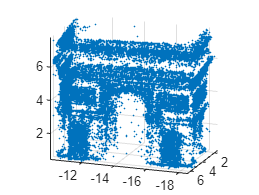
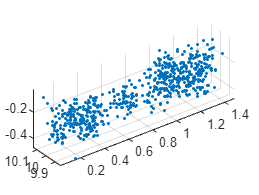
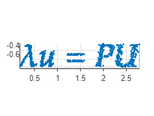
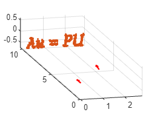
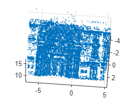
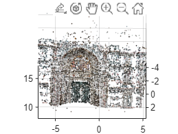

# Table of contents
- [Ex 4.1](#ex-41)
- [Ex 4.2 ](#ex-42)
- [Ex 4.3](#ex-43)
- [Ex 4.4](#ex-44)
- [Ex 4.5](#ex-45)
- [Ex 4.6](#ex-46)
- [Ex 4.7 ](#ex-47)
- [Ex 4.8](#ex-48)
- [Ex 4.9 ](#ex-49)
- [Ex 4.10](#ex-410)
- [Ex 4.11](#ex-411)
- [Ex 4.12](#ex-412)
- [Ex 4.13](#ex-413)
- [Ex 4.14 ](#ex-414)
- [Ex 4.15](#ex-415)


# Notes regarding lab format


We will use Matlab Livescript for this lab. Livescript allows switching between text and code cells. 


You will find the entire lab manual in this file. Some exercises require you to write a text answer, others require you to write code. You should not define functions inside this file. Instead save functions to the functions folder and call them from the code cells in this notebook.


Your finished lab report should be a .zip-file containing the data folder, your functions folder and this livescript file. As usual, you should also provide a pdf of the result of running the live script (in the Live Editor, you can **export to pdf** under Save) where all result images should be visible.


Since we need to access the functions and data folder the first step is to add these two locations MATLAB's path.


```matlab:Code
addpath('./functions');
addpath('./data');
```

# **Lab 4 - Triangulation**
# **Using RANSAC**
  


This whole lab is basically concerned with the camera equation


$$
\lambda u=P\,U
$$


For the uncalibrated case, $u$ is a 3-vector with the coordinates of a point in the image (and an added 1)


$$
u=\left\lbrack \begin{array}{c}
x\\
y\\
1
\end{array}\right\rbrack
$$


and $U$ is a 4-vector containing the coordinates of the corresponding 3D point along with a 1 in its last element. A function


```matlab:Code
sigma = 0.5;
[Ps, us, U_true] = triangulation_test_case(sigma)
```

| |1|2|
|:--:|:--:|:--:|
|1|3x4 double|3x4 double|


```text:Output
us = 2x2    
  -12.7722 -139.8605
   37.2974 -213.2782

U_true = 3x1    
    0.6962
    0.1764
    0.7772

```


is provided for creating a simple test case where you know the correct answer (**`U_true`**). Gaussian noise of standard deviation **`sigma`** is added to the image points. Use this example to evaluate your minimal solver.


# Ex 4.1     
Make a minimal solver for the triangulation problem, that is, a function 


```matlab:Code
U = minimal_triangulation(Ps, us)
```


```text:Output
U = 3x1    
    0.6948
    0.1768
    0.7691

```


that takes two camera matrices, **`Ps`**, and two image points, **`us`**, and triangulates a 3D point. The image points are a 2 x 2 array whereas the camera matrices is a cell list with one camera matrix in each cell. 


Recall that $\lambda$ is the *depth*. Points with negative depth would lie behind the camera, so negative depths indicate that something is wrong.


# Ex 4.2     
Make a function 


```matlab:Code
positive = check_depths(Ps, U)
```


```text:Output
positive = 1x2    
     1     1

```


that takes *N* camera matrices, **`Ps`**, and a 3D point, **`U`**, and checks the depth of **`U`** in each of the cameras. The output should be a an array of boolean values of length *N* that indicates which depths were positive. (Matlab will print boolean values as zeros and ones, so don’t be confused by this.)


# Ex 4.3     
Make a function 


```matlab:Code
errors = reprojection_errors(Ps, us, U)
```


```text:Output
errors = 2x1    
    0.2007
    0.2183

```


that takes *N* camera matrices, **`Ps`**, *N* image points, **`us`**, and a 3D point, **`U`**, and computes a vector with the reprojection errors, that is, the lengths of the reprojection residuals. If a point has negative depth, set the reprojection error to `Inf`. 


# Ex 4.4     
Make a function 


```matlab:Code
threshold =  2
```


```text:Output
threshold = 2
```


```matlab:Code
[U, nbr_inliers] = ransac_triangulation(Ps, us, threshold) 
```


```text:Output
U = 3x1    
    0.6948
    0.1768
    0.7691

nbr_inliers = 2
```


that implements triangulation using RANSAC. Use the number of outliers as loss function. A measurement is deemed as an outlier if the depth is negative or if the reprojection error is larger than `threshold`. 


In `sequence.mat` you find a struct array `triangulation_examples` with triangulation examples. Each example (3D point) has a cell list of camera matrices **`Ps`** and a 2 x N-array **`us`** with image points. It will take some time to triangulate all 32183 examples so start with the first 1000 or so. We used a RANSAC threshold of 5 pixels. 


# Ex 4.5     
Make a script **`triangulate_sequence`** that runs **`ransac_triangulation`** for all (or at least 1000) of the examples from `sequence.mat`. Store all triangulated points with at least two inliers and plot them using `scatter3`. There will always be a few outliers among the estimated 3D points that make it harder to view the plot. You can use the provided `clean_for_plot.m` to clean it up a bit. 


```matlab:Code
triangulate_sequence   % Script that you need to create

Uc = clean_for_plot(Us) 
```


```text:Output
Uc = 3x30263    
  -17.4757  -18.1835  -15.7918  -14.0339  -16.7314  -16.5074  -14.8940  -17.9623  -17.2062  -16.6123  -14.5090  -12.6667  -12.6764  -12.6051  -13.0341  -17.6782  -17.8065  -17.5078  -17.0011  -12.6818  -13.0160  -13.1481  -18.3488  -18.1503  -17.2474  -17.1389  -17.0443  -16.9480  -16.8991  -16.7434  -15.6448  -12.5890  -13.0470  -13.0020  -13.1167  -12.9180  -18.3837  -18.2647  -18.0201  -17.8732  -17.5089  -17.5871  -17.3946  -17.3720  -17.4167  -17.4102  -17.3038  -17.1688  -17.1634  -17.1172
    4.0865    4.8943    5.3986    5.5834    5.3267    5.2593    5.5541    5.2541    5.4890    5.4789    5.7310    2.1570    2.5267    2.4356    5.1055    5.2805    5.2810    5.3272    5.6129    3.1657    5.0561    6.1794    5.1543    5.2059    5.6230    5.5944    5.5588    5.5934    5.5518    5.2387    5.4719    3.2509    5.3341    5.3412    5.7126    5.8605    5.0429    5.2363    5.1931    5.5797    5.3453    5.3050    5.4459    5.5079    5.2801    5.2707    5.6558    5.5421    5.5697    5.5210
    6.6273    4.9062    3.2268    4.5407    7.0615    2.0498    4.7146    6.9891    1.8932    2.2355    7.0889    3.3857    2.7649    1.5875    2.9715    2.2780    7.1659    5.9543    7.4724    2.0478    2.4724    5.9629    5.1930    5.1881    1.3179    1.1272    1.1697    1.1746    1.1922    7.6267    4.5099    2.1815    2.8177    0.9854    3.7271    4.8289    6.9673    5.3410    6.8299    6.1352    2.1347    5.3805    1.8362    1.9102    4.0323    4.0373    1.6285    1.0505    2.4418    2.1250

```


```matlab:Code
scatter3(Uc(1,:),Uc(2,:),Uc(3,:),0.5,'.') 
axis equal
view([-159.8 16.3])
```





Can you recognize the building? 


**Write your answer with explanation as a comment here.**


```matlab:Code
% It looks like the Arc de Triomphe
```

# Least squares triangulation 


In this part of the lab you will solve the tringulation problem through least squares. Just as in the case of registration, the following pipeline is recommended: 


    - Use RANSAC to obtain a rough estimate of the parameters (*U*). 


    - Remove all measurements which are outliers with respect to these parameters. 


    - Estimate the least squares parameters using the remaining measurements. 


Note that in this case a *measurement* is a pair consisting of an image point $u_i$ and a camera matrix $P_i$. Don’t forget that points with negative depths should be outliers. 


# Ex 4.6     
Consider a camera matrix 


                        $P_i =\left\lbrack \begin{array}{c}
\longleftarrow a_i^T \longrightarrow \\
\longleftarrow b_i^T \longrightarrow \\
\longleftarrow c_i^T \longrightarrow 
\end{array}\right\rbrack$ ,


a 3D point *U* and an image point $u_i$. Write the formula for the reprojection error $r_i \left(U\right)$ below.


**Your answer here:**


$$
r_i \left(U\right)=\left\lbrack \begin{array}{c}
\frac{a_i^T U}{c_i^T U}-x_i \\
\frac{b_i^T U}{c_i^T U}-y_i 
\end{array}\right\rbrack ,u_i =\left(x_i \;,y_i \;\right)
$$


As you can see, the residuals are no longer linear, so computing a least squares solution will be significantly harder than in the previous lab. In fact, we cannot be sure to find the least squares solution. What we can do is to use local optimization to reduce the sum of squared residuals. We start at the solution produced by Ransac and use a few Gauss-Newton iterations.


# Ex 4.7     
Make a function  


```matlab:Code(Display)
all_residuals = compute_residuals(Ps, us, U);
```


that takes a cell list **`Ps`** with *N* cameras, a 2 x *N* array **`us`** of image points and a 3 x 1 array **`U`**, and computes a 2*N* x 1 array with all the reprojection residuals stacked into a single vector/array. A reprojection residual is a 2D vector corresponding to the difference between the original measurement and the projected point. The stacked vector is the $\bar{r}$ from the lecture notes (page 99).


```matlab:Code
% usage example
points3D = triangulation_examples;
all_residuals = compute_residuals(points3D(1).Ps, points3D(1).xs, Us(:,1))
```


```text:Output
all_residuals = 32x1    
  -10.8294
   -0.6098
   -3.7199
    0.2372
   -1.4702
   -1.4635
    1.6248
    3.0795
    0.1536
    1.6286

```


# Ex 4.8     
Find formulas for the partial derivatives in the Jacobian of $\bar{r}$. The Jacobian should be a 2N x 3- matrix. (Hint: you can start by finding the formula to the Jacobian of the i-th residual, which is a 2x3 matrix.)


# Your answer here:

$$
J_i =\left\lbrack \begin{array}{c}
\frac{a_i^T \left(c_i^T U\right)-\left(a_i^T U\right)c_i^T }{{\left(c_i^T U\right)}^2 }\\
\frac{b_i^T \left(c_i^T U\right)-\left(b_i^T U\right)c_i^T }{{\left(c_i^T U\right)}^2 }
\end{array}\right\rbrack
$$


To form the entire Jacobian we can stack each Jacobian of the i-th residual


# Ex 4.9     
Make a function 


```matlab:Code(Display)
jacobian = compute_jacobian(Ps, U)
```


that computes the Jacobian given a 3 x 1- vector **`U`** and a cell array of camera matrices **`Ps`**. 


```matlab:Code
% usage example
all_residuals = compute_jacobian(points3D(1).Ps, Us(:,1))
```


```text:Output
all_residuals = 32x3    
  -16.7767   72.9558  145.2213
 -159.8767  -16.4169   -7.4196
  -23.6948   74.0050  147.6152
 -161.4065  -25.1126   -9.7213
  -27.9435   69.9199  144.9500
 -157.5396  -31.9701  -10.9072
  -28.7495   68.2930  144.5159
 -155.4100  -37.8724   -8.7934
  -29.3783   68.8864  145.3788
 -155.3957  -42.1020   -7.3096

```


# Ex 4.10     
Use these functions to make a function 


```matlab:Code(Display)
U = refine_triangulation(Ps, us, Uhat)
```


that uses an approximate 3D point **`Uhat`** as a starting point for Gauss-Newton’s method. Use five GaussNewton iterations. Print the sum of squared residuals after each Gauss-Newton step to verify that it decreases. 


```matlab:Code
% usage example
Uref = refine_triangulation(points3D(1).Ps, points3D(1).xs, Us(:,1))
```


```text:Output
Uref = 3x1    
  -17.4131
    3.8202
    6.7842

```


# Ex 4.11     
Try your `refine_triangulation` on the data in `gauss_newton.ma`t. First we will plot the points given in **`Uhat`**, then refine each point using your function and plot the results using `scatter3`. You should see an improvement. 


```matlab:Code
% don't forget to plot your results
load gauss_newton
scatter3(Uhat(1,:),Uhat(2,:),Uhat(3,:),'.') 
axis equal
```





```matlab:Code

Ps = {P,P_tilde};

N = size(Uhat,2);
Uref = zeros(3,N);
for i = 1:N
    Uref(:,i) = refine_triangulation(Ps, [u(:,i), u_tilde(:,i)], Uhat(:,1));
end
scatter3(Uref(1,:),Uref(2,:),Uref(3,:),'.') 
axis equal

view([-0.05 5.13])
```





# Ex* 4.12     
Compute the camera positions for the data in `gauss_newton.mat` and plot them together with the estimated 3D points. Try to understand why the noise in the estimated points looks as it does. 


```matlab:Code
% YOUR CODE HERE; don't forget to plot your results
N_cameras = length(Ps);

c = zeros(4, N_cameras);
v = zeros(3, N_cameras);
for i=1:N_cameras
    
    c(:,i) = null(Ps{i});
    v(:,i) = Ps{i}(3,1:3);

end

c = c./repmat(c(4,:),[4 1]);

disp(['First Camera',newline, ...
    'Center',newline, ...
    num2str(c(1:3,1)'),newline ...
    ,'Main Axis',newline, ...
    num2str(v(:,1)')])
```


```text:Output
First Camera
Center
0  0  0
Main Axis
0  1  0
```


```matlab:Code

disp(['Second Camera',newline, ...
    'Center',newline, ...
    num2str(c(1:3,2)'),newline ...
    ,'Main Axis',newline, ...
    num2str(v(:,2)')])
```


```text:Output
Second Camera
Center
0.83205  1.1175e-16      0.5547
Main Axis
0.049602      0.9964    0.068803
```


```matlab:Code

quiver3(c(1,:),c(2,:),c(3,:),v(1,:), v(2,:), v(3,:),['r','-'],'LineWidth',1.5,'MaxHeadSize',1.5);
hold on
scatter3(Uref(1,:),Uref(2,:),Uref(3,:),'.') 
axis equal
hold off

view([-14.66 13.23])
```





For the next exercise try the following way to match features, 


```matlab:Code(Display)
matchFeatures(d1,d2,'Method','Approximate','MaxRatio',0.9,'MatchThreshold',100);
```


The approximate option makes it go significantly faster. A Lowe ratio of 0.9 is very high, but it makes the model more *dens*e. 


# Ex 4.13     
There are images `duomo.jpg` and `duomo_tilde.jpg` in the lab folder and also a data file `duomo.mat` with two camera matrices. Extract SIFT features from the two images using `detectSIFTFeatures` and `extractFeatures`, then match them using `matchFeatures`. Also store the color of each SIFT point. It doesn’t matter from which of the images you select the color information. 


Use your triangulation code (don’t forget r`efine_triangulation`) to triangulate the points and plot them with the right color using `scatter3`. Again, you can use `clean_for_plot.m` to remove outliers among the estimated 3D points. Beware that triangulating all the points will take a little time so work with a subset until you are sure that the code works. 


```matlab:Code
% Your code here
load duomo
A_img = imread("duomo.jpg");
B_img = imread("duomo_tilde.jpg");
A = rgb2gray(A_img);
B = rgb2gray(B_img);

points_A = detectSIFTFeatures(A);
[d1, validPointsA] = extractFeatures(A,points_A);

points_B = detectSIFTFeatures(B);
[d2, validPointsB] = extractFeatures(B,points_B);

matches = matchFeatures(d1,d2,'Method','Approximate','MaxRatio',0.9,'MatchThreshold',100);

u = validPointsA(matches(:,1)).Location';

u_tilde = validPointsB(matches(:,2)).Location';
```


```matlab:Code
Ps = {P,P_tilde};
threshold = 10;
Us = [];
N_examples = length(matches);
inliers = [];
for i=1:N_examples

    xs = [u(:,i) , u_tilde(:,i)];
    
    [U, nbr_inliers] = ransac_triangulation(Ps, xs, threshold);

    if nbr_inliers >=2
        Us = [Us U];
        inliers = [inliers, i];
    end

    

end
```


```matlab:Code
colors = impixel(A_img, round(u(1,:)), round(u(2,:)))/255;
[Uc,removed_indeces]  = clean_for_plot(Us);
scatter3(Uc(1,:),Uc(2,:),Uc(3,:),0.5,'.') 
axis equal

view([-4.35 -69.21])
```





```matlab:Code
warning('off','all')
Uhat = Us;
N = length(inliers);
Uref = zeros(3,N);
colors = [];
for i = 1:N
    idx = inliers(i);
    Uref(:,i) = refine_triangulation(Ps, [u(:,idx), u_tilde(:,idx)], Uhat(:,1));
end
```


```matlab:Code
[Uref, removed_indeces] = clean_for_plot(Uref);
% colors(removed_indices,:)= [];
```


```matlab:Code
u = Ps{1}*[Uref;ones(1,size(Uref,2))];
u = u(1:2,:)./u(3,:);
```


```matlab:Code
n_points = size(u,2);
colors = impixel(A_img, round(u(1,:)), round(u(2,:)))/255;
scatter3(Uref(1,:),Uref(2,:),Uref(3,:),1,colors,'.')
% set(gca,'color',[0 0 0])
axis equal

view([-0.1 -49.3])
```





```matlab:Code
N_cameras = length(Ps);

c = zeros(4, N_cameras);
v = zeros(3, N_cameras);
for i=1:N_cameras
    
    c(:,i) = null(Ps{i});
    v(:,i) = Ps{i}(3,1:3);

end

c = c./repmat(c(4,:),[4 1]);

disp(['First Camera',newline, ...
    'Center',newline, ...
    num2str(c(1:3,1)'),newline ...
    ,'Main Axis',newline, ...
    num2str(v(:,1)')])

disp(['Second Camera',newline, ...
    'Center',newline, ...
    num2str(c(1:3,2)'),newline ...
    ,'Main Axis',newline, ...
    num2str(v(:,2)')])

quiver3(c(1,:),c(2,:),c(3,:),v(1,:), v(2,:), v(3,:),['r','-'],'LineWidth',1.5,'MaxHeadSize',1.5);
hold on
scatter3(Uref(1,:),Uref(2,:),Uref(3,:), 0.5,'.') 
axis equal
hold off

view([7.0 -48.0])
```

# **Essential Matrix**


The two exercises below are optional and therefore marked with *****.


#Ex* 4.14     
Load the data in `P.mat`. There you will find two calibrated camera matrices, `P1` and `P2`. Make a function 


```matlab:Code(Display)
    E = essentialMatrix(P1,P2) 
```


that computes the essential matrix `E` from `P1` and `P2` .


```matlab:Code
load P.mat

```


# Ex* 4.15     
Similar to the reprojection error in the triangulation problem, the essential matrix can also be used for outlier detection using the residual


$$
r^2 =\frac{\left|{\tilde{x} }^T \;E\;x\;\right|}{{\left\|S\;E\;x\right\|}^2 +{\left\|S\;E^T \;\;\tilde{x} \right\|}^2 \;},\;\;\;\;\;\;\;\;\;\;S=\left\lbrack \begin{array}{ccc}
1 & 0 & 0\\
0 & 1 & 0\\
0 & 0 & 0
\end{array}\right\rbrack
$$


where $x$ and $\tilde{x}$ are the image projections of a 3D point *X* using some arbitrary camera matrices $P$ and $\tilde{P}$, respectively. Note that $r$ does not depend on X. Assuming that you are using a similar threshold for outlier detection, for a set of pixel correspondences, you would get `I1` inliers if you use the residual from the triangulation problem and `I2` inliers if you used the residual from (4.4). Which one is greater, `I1` or `I2`? Why? 


```matlab:Code

```

