# Table of contents
- [PROJECT 1](#project-1)
  - [Miscellaneous](#miscellaneous)
  - [Base Model](#base-model)
  - [Improved Model](#improved-model)
  - [Ablation Study](#ablation-study)
    - [Improved Model (no scheduler)](#improved-model-(no-scheduler))
    - [Improved Model (no learn drop factor)](#improved-model-(no-learn-drop-factor))
    - [Improved Model (no l2 regularization)](#improved-model-(no-l2-regularization))
    - [Improved Model (no batch norm)](#improved-model-(no-batch-norm))
    - [Improved Model (no drop out)](#improved-model-(no-drop-out))
- [Advanced Part Project 1](#advanced-part-project-1)
- [Miscellaneous](#miscellaneous)
  - [Analyzing the network](#analyzing-the-network)
  - [Feature Extraction](#feature-extraction)
  - [Plotting the images](#plotting-the-images)
  - [Empirical Study](#empirical-study)


# PROJECT 1
## Miscellaneous


Adding the path to the `functions `and `data` folder. In `functions `you can find the functions used in this project. In `data` you can find the datasets used.


```matlab:Code
addpath('./functions');
addpath('./data');
```


Created a function `load_data `that takes as input the location of the CIFAR10 dataset. The function looks for the "cifar-10-batches-mat" folder and creates a training and test set. Additionally, the function carries out the some permutation on the data such as: reshape, converts labels to categorical, flips the images by 90deg.


```matlab:Code
[XTrain, YTrain, XTest, YTest] = load_data('data');
```


This code samples randomly from the training set and displays the image with its label.


```matlab:Code
idx = randi(size(XTrain,4));

imagesc(XTrain(:,:,:,idx))
title(YTrain(idx))
```


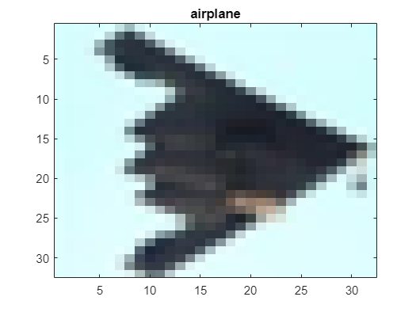

## Base Model


Here I defined a first basic classifier and perfomed its training.


```matlab:Code
layers = basic_cnn_classifier_v2();

opts = trainingOptions('sgdm', ...
    'Momentum', 0.9, ...
    'InitialLearnRate', 0.001, ...
    'MaxEpochs', 10, ...
    'MiniBatchSize', 128, ...
    'Verbose', true,...
    'Plots','training-progress',...
    'ExecutionEnvironment','gpu');

basic_net = trainNetwork(XTrain, YTrain, layers, opts);
```


```text:Output
Initializing input data normalization.
|========================================================================================|
|  Epoch  |  Iteration  |  Time Elapsed  |  Mini-batch  |  Mini-batch  |  Base Learning  |
|         |             |   (hh:mm:ss)   |   Accuracy   |     Loss     |      Rate       |
|========================================================================================|
|       1 |           1 |       00:00:04 |       13.28% |       2.3054 |          0.0010 |
|       1 |          50 |       00:00:13 |       10.16% |       2.3038 |          0.0010 |
|       1 |         100 |       00:00:22 |       21.09% |       2.1012 |          0.0010 |
|       1 |         150 |       00:00:29 |       27.34% |       2.0246 |          0.0010 |
|       1 |         200 |       00:00:35 |       28.91% |       1.9084 |          0.0010 |
|       1 |         250 |       00:00:44 |       31.25% |       1.7814 |          0.0010 |
|       1 |         300 |       00:00:52 |       31.25% |       1.8145 |          0.0010 |
|       1 |         350 |       00:01:00 |       33.59% |       1.7769 |          0.0010 |
|       2 |         400 |       00:01:10 |       39.84% |       1.6022 |          0.0010 |
|       2 |         450 |       00:01:20 |       42.97% |       1.6119 |          0.0010 |
|       2 |         500 |       00:01:31 |       43.75% |       1.5007 |          0.0010 |
|       2 |         550 |       00:01:36 |       40.62% |       1.5714 |          0.0010 |
|       2 |         600 |       00:01:40 |       54.69% |       1.4029 |          0.0010 |
|       2 |         650 |       00:01:46 |       40.62% |       1.4598 |          0.0010 |
|       2 |         700 |       00:01:52 |       48.44% |       1.4097 |          0.0010 |
|       2 |         750 |       00:01:55 |       47.66% |       1.5252 |          0.0010 |
|       3 |         800 |       00:02:03 |       48.44% |       1.4048 |          0.0010 |
|       3 |         850 |       00:02:13 |       53.12% |       1.3706 |          0.0010 |
|       3 |         900 |       00:02:21 |       48.44% |       1.3780 |          0.0010 |
|       3 |         950 |       00:02:24 |       53.12% |       1.3198 |          0.0010 |
|       3 |        1000 |       00:02:32 |       60.16% |       1.1748 |          0.0010 |
|       3 |        1050 |       00:02:41 |       45.31% |       1.4849 |          0.0010 |
|       3 |        1100 |       00:02:50 |       58.59% |       1.1705 |          0.0010 |
|       3 |        1150 |       00:03:02 |       51.56% |       1.3697 |          0.0010 |
|       4 |        1200 |       00:03:31 |       60.94% |       1.2650 |          0.0010 |
|       4 |        1250 |       00:03:34 |       50.00% |       1.4018 |          0.0010 |
|       4 |        1300 |       00:03:39 |       48.44% |       1.3429 |          0.0010 |
|       4 |        1350 |       00:03:44 |       51.56% |       1.2732 |          0.0010 |
|       4 |        1400 |       00:03:54 |       53.91% |       1.2466 |          0.0010 |
|       4 |        1450 |       00:04:02 |       57.81% |       1.1993 |          0.0010 |
|       4 |        1500 |       00:04:07 |       60.16% |       1.0504 |          0.0010 |
|       4 |        1550 |       00:04:12 |       60.16% |       1.2055 |          0.0010 |
|       5 |        1600 |       00:04:19 |       60.16% |       1.1629 |          0.0010 |
|       5 |        1650 |       00:04:28 |       54.69% |       1.3604 |          0.0010 |
|       5 |        1700 |       00:04:37 |       59.38% |       1.2608 |          0.0010 |
|       5 |        1750 |       00:04:47 |       61.72% |       1.0777 |          0.0010 |
|       5 |        1800 |       00:04:57 |       58.59% |       1.2184 |          0.0010 |
|       5 |        1850 |       00:05:06 |       64.84% |       1.1465 |          0.0010 |
|       5 |        1900 |       00:05:08 |       53.12% |       1.2623 |          0.0010 |
|       5 |        1950 |       00:05:15 |       56.25% |       1.1685 |          0.0010 |
|       6 |        2000 |       00:05:18 |       59.38% |       1.1693 |          0.0010 |
|       6 |        2050 |       00:05:26 |       60.16% |       1.1278 |          0.0010 |
|       6 |        2100 |       00:05:35 |       53.91% |       1.2602 |          0.0010 |
|       6 |        2150 |       00:05:46 |       56.25% |       1.1980 |          0.0010 |
|       6 |        2200 |       00:05:48 |       64.06% |       1.0543 |          0.0010 |
|       6 |        2250 |       00:05:54 |       61.72% |       1.1105 |          0.0010 |
|       6 |        2300 |       00:06:00 |       60.16% |       1.0996 |          0.0010 |
|       7 |        2350 |       00:06:07 |       60.16% |       1.1377 |          0.0010 |
|       7 |        2400 |       00:06:13 |       57.81% |       1.1862 |          0.0010 |
|       7 |        2450 |       00:06:18 |       69.53% |       1.0062 |          0.0010 |
|       7 |        2500 |       00:06:27 |       61.72% |       1.0567 |          0.0010 |
|       7 |        2550 |       00:06:37 |       67.19% |       1.0424 |          0.0010 |
|       7 |        2600 |       00:06:47 |       62.50% |       1.0346 |          0.0010 |
|       7 |        2650 |       00:06:50 |       63.28% |       1.0563 |          0.0010 |
|       7 |        2700 |       00:06:55 |       61.72% |       1.1040 |          0.0010 |
|       8 |        2750 |       00:07:01 |       62.50% |       1.0353 |          0.0010 |
|       8 |        2800 |       00:07:04 |       66.41% |       1.0239 |          0.0010 |
|       8 |        2850 |       00:07:13 |       65.62% |       1.0603 |          0.0010 |
|       8 |        2900 |       00:07:23 |       68.75% |       0.9643 |          0.0010 |
|       8 |        2950 |       00:07:31 |       66.41% |       0.9600 |          0.0010 |
|       8 |        3000 |       00:07:37 |       60.16% |       1.1336 |          0.0010 |
|       8 |        3050 |       00:07:45 |       68.75% |       0.9379 |          0.0010 |
|       8 |        3100 |       00:07:54 |       59.38% |       1.0801 |          0.0010 |
|       9 |        3150 |       00:08:03 |       61.72% |       1.0775 |          0.0010 |
|       9 |        3200 |       00:08:13 |       63.28% |       1.0813 |          0.0010 |
|       9 |        3250 |       00:08:23 |       64.84% |       1.0505 |          0.0010 |
|       9 |        3300 |       00:08:34 |       61.72% |       0.9652 |          0.0010 |
|       9 |        3350 |       00:08:36 |       64.06% |       1.1092 |          0.0010 |
|       9 |        3400 |       00:08:43 |       65.62% |       1.0297 |          0.0010 |
|       9 |        3450 |       00:08:53 |       68.75% |       0.8434 |          0.0010 |
|       9 |        3500 |       00:08:59 |       67.19% |       0.8890 |          0.0010 |
|      10 |        3550 |       00:09:04 |       66.41% |       0.9941 |          0.0010 |
|      10 |        3600 |       00:09:09 |       64.84% |       1.1145 |          0.0010 |
|      10 |        3650 |       00:09:17 |       66.41% |       0.9309 |          0.0010 |
|      10 |        3700 |       00:09:26 |       67.97% |       0.9787 |          0.0010 |
|      10 |        3750 |       00:09:35 |       64.06% |       1.0298 |          0.0010 |
|      10 |        3800 |       00:09:46 |       67.97% |       1.0207 |          0.0010 |
|      10 |        3850 |       00:09:57 |       64.06% |       0.8537 |          0.0010 |
|      10 |        3900 |       00:10:02 |       62.50% |       1.0181 |          0.0010 |
|========================================================================================|
Training finished: Max epochs completed.
```


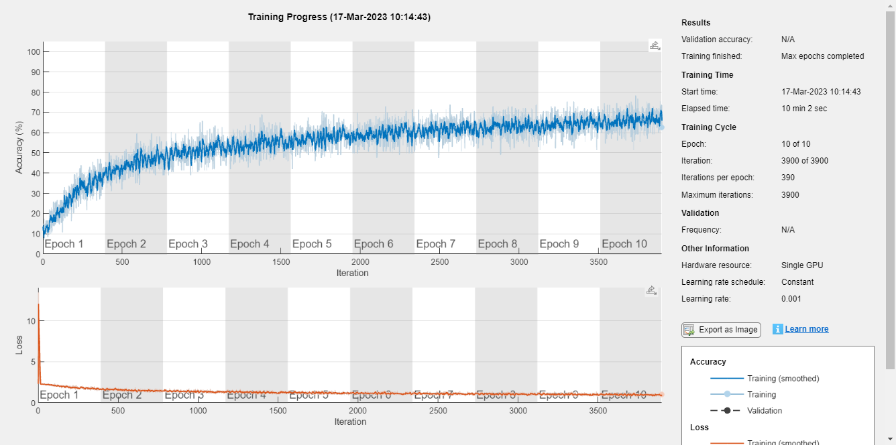


```matlab:Code
preds = basic_net.classify(XTest);
tp = nnz(preds == YTest);
accuracy = tp / length(YTest);
disp(['The network achieved an accuracy of: ', num2str((accuracy)*100), '%'])
```


```text:Output
The network achieved an accuracy of: 60.92%
```


```matlab:Code
confusionchart(YTest,preds)
```


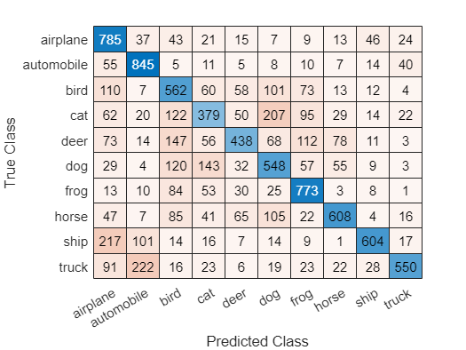


```matlab:Code
indeces = find(preds ~= YTest);
idx = datasample(indeces,2);
subplot(1,2,1);
imshow(XTest(:,:,:,idx(1)));
title([YTest(idx(1)), "mistaken as ", preds(idx(1))])
subplot(1,2,2);
imshow(XTest(:,:,:,idx(2)));
title([YTest(idx(2)), "mistaken as ", preds(idx(2))])
```


## Improved Model


Here I improved the model and trained it.


```matlab:Code
layers = improved_cnn_classifier_v2();
[X_train, X_val, Y_train, Y_val] = train_test_split(XTrain,YTrain,0.1);
opts = trainingOptions('sgdm', ...
    'Momentum', 0.9, ...
    'InitialLearnRate', 0.0002, ...
    'LearnRateSchedule', 'piecewise', ...
    'LearnRateDropFactor', 0.1, ...
    'LearnRateDropPeriod', 16, ...
    'L2Regularization', 0.004, ...
    'ValidationData',{X_val, Y_val}, ...
    'OutputNetwork','best-validation-loss', ...
    'MaxEpochs', 20, ...
    'MiniBatchSize', 128, ...
    'Verbose', true,...
    'Plots','training-progress',...
    'ExecutionEnvironment','gpu');

improved_net = trainNetwork(X_train, Y_train, layers, opts);
```


```text:Output
Initializing input data normalization.
|======================================================================================================================|
|  Epoch  |  Iteration  |  Time Elapsed  |  Mini-batch  |  Validation  |  Mini-batch  |  Validation  |  Base Learning  |
|         |             |   (hh:mm:ss)   |   Accuracy   |   Accuracy   |     Loss     |     Loss     |      Rate       |
|======================================================================================================================|
|       1 |           1 |       00:00:05 |        6.25% |       10.94% |       2.3035 |       2.3017 |          0.0002 |
|       1 |          50 |       00:00:18 |       21.09% |       21.94% |       2.2050 |       2.2018 |          0.0002 |
|       1 |         100 |       00:00:30 |       21.09% |       24.34% |       2.1074 |       2.0737 |          0.0002 |
|       1 |         150 |       00:00:39 |       31.25% |       29.06% |       1.9105 |       1.9642 |          0.0002 |
|       1 |         200 |       00:00:50 |       35.94% |       33.28% |       1.8049 |       1.8869 |          0.0002 |
|       1 |         250 |       00:01:02 |       32.81% |       35.18% |       1.8095 |       1.8148 |          0.0002 |
|       1 |         300 |       00:01:14 |       32.03% |       36.30% |       1.9003 |       1.7752 |          0.0002 |
|       1 |         350 |       00:01:24 |       39.84% |       38.04% |       1.7714 |       1.7271 |          0.0002 |
|       2 |         400 |       00:01:28 |       45.31% |       38.76% |       1.5744 |       1.6919 |          0.0002 |
|       2 |         450 |       00:01:39 |       42.19% |       39.82% |       1.6695 |       1.6568 |          0.0002 |
|       2 |         500 |       00:01:50 |       41.41% |       42.30% |       1.5622 |       1.6233 |          0.0002 |
|       2 |         550 |       00:02:01 |       43.75% |       43.06% |       1.5212 |       1.6053 |          0.0002 |
|       2 |         600 |       00:02:13 |       40.62% |       43.92% |       1.5378 |       1.5716 |          0.0002 |
|       2 |         650 |       00:02:26 |       50.00% |       43.50% |       1.5144 |       1.5841 |          0.0002 |
|       2 |         700 |       00:02:34 |       42.97% |       44.18% |       1.5707 |       1.5580 |          0.0002 |
|       3 |         750 |       00:02:40 |       38.28% |       44.78% |       1.5868 |       1.5364 |          0.0002 |
|       3 |         800 |       00:02:51 |       46.09% |       45.24% |       1.6421 |       1.5216 |          0.0002 |
|       3 |         850 |       00:03:03 |       41.41% |       47.20% |       1.5529 |       1.4961 |          0.0002 |
|       3 |         900 |       00:03:15 |       45.31% |       47.42% |       1.4558 |       1.4886 |          0.0002 |
|       3 |         950 |       00:03:23 |       45.31% |       47.72% |       1.5404 |       1.4693 |          0.0002 |
|       3 |        1000 |       00:03:30 |       49.22% |       47.70% |       1.3670 |       1.4846 |          0.0002 |
|       3 |        1050 |       00:03:41 |       54.69% |       48.34% |       1.3027 |       1.4584 |          0.0002 |
|       4 |        1100 |       00:03:52 |       46.88% |       48.36% |       1.5793 |       1.4413 |          0.0002 |
|       4 |        1150 |       00:04:05 |       44.53% |       49.04% |       1.5236 |       1.4336 |          0.0002 |
|       4 |        1200 |       00:04:15 |       57.03% |       49.70% |       1.3011 |       1.4077 |          0.0002 |
|       4 |        1250 |       00:04:21 |       42.97% |       50.40% |       1.5224 |       1.4018 |          0.0002 |
|       4 |        1300 |       00:04:31 |       49.22% |       50.76% |       1.4680 |       1.3884 |          0.0002 |
|       4 |        1350 |       00:04:43 |       42.19% |       50.46% |       1.4894 |       1.4103 |          0.0002 |
|       4 |        1400 |       00:04:55 |       47.66% |       52.16% |       1.3590 |       1.3835 |          0.0002 |
|       5 |        1450 |       00:05:06 |       50.78% |       52.24% |       1.3617 |       1.3627 |          0.0002 |
|       5 |        1500 |       00:05:19 |       58.59% |       52.42% |       1.2224 |       1.3583 |          0.0002 |
|       5 |        1550 |       00:05:28 |       43.75% |       52.42% |       1.5818 |       1.3371 |          0.0002 |
|       5 |        1600 |       00:05:36 |       58.59% |       53.68% |       1.3005 |       1.3264 |          0.0002 |
|       5 |        1650 |       00:05:47 |       50.78% |       53.64% |       1.4058 |       1.3215 |          0.0002 |
|       5 |        1700 |       00:05:59 |       60.94% |       53.36% |       1.2973 |       1.3299 |          0.0002 |
|       5 |        1750 |       00:06:11 |       57.03% |       53.70% |       1.3485 |       1.3128 |          0.0002 |
|       6 |        1800 |       00:06:24 |       46.88% |       54.64% |       1.4167 |       1.2978 |          0.0002 |
|       6 |        1850 |       00:06:28 |       56.25% |       54.88% |       1.2222 |       1.2931 |          0.0002 |
|       6 |        1900 |       00:06:39 |       50.00% |       54.80% |       1.4593 |       1.2822 |          0.0002 |
|       6 |        1950 |       00:06:51 |       50.00% |       55.54% |       1.3213 |       1.2692 |          0.0002 |
|       6 |        2000 |       00:07:03 |       56.25% |       55.36% |       1.3495 |       1.2687 |          0.0002 |
|       6 |        2050 |       00:07:10 |       57.81% |       56.74% |       1.2672 |       1.2588 |          0.0002 |
|       6 |        2100 |       00:07:20 |       59.38% |       55.12% |       1.2048 |       1.2666 |          0.0002 |
|       7 |        2150 |       00:07:31 |       52.34% |       57.10% |       1.3370 |       1.2388 |          0.0002 |
|       7 |        2200 |       00:07:43 |       60.16% |       56.92% |       1.1142 |       1.2370 |          0.0002 |
|       7 |        2250 |       00:07:56 |       57.03% |       56.82% |       1.2601 |       1.2269 |          0.0002 |
|       7 |        2300 |       00:08:06 |       51.56% |       57.68% |       1.4118 |       1.2204 |          0.0002 |
|       7 |        2350 |       00:08:18 |       54.69% |       57.70% |       1.2562 |       1.2165 |          0.0002 |
|       7 |        2400 |       00:08:30 |       50.00% |       58.08% |       1.2598 |       1.2082 |          0.0002 |
|       7 |        2450 |       00:08:43 |       49.22% |       56.70% |       1.3048 |       1.2270 |          0.0002 |
|       8 |        2500 |       00:08:53 |       54.69% |       58.86% |       1.1773 |       1.1951 |          0.0002 |
|       8 |        2550 |       00:09:00 |       62.50% |       57.94% |       1.2034 |       1.2054 |          0.0002 |
|       8 |        2600 |       00:09:12 |       55.47% |       59.00% |       1.2767 |       1.1802 |          0.0002 |
|       8 |        2650 |       00:09:35 |       50.78% |       58.80% |       1.3293 |       1.1818 |          0.0002 |
|       8 |        2700 |       00:09:45 |       52.34% |       58.46% |       1.3285 |       1.1893 |          0.0002 |
|       8 |        2750 |       00:09:53 |       58.59% |       59.86% |       1.1733 |       1.1607 |          0.0002 |
|       8 |        2800 |       00:10:04 |       51.56% |       58.36% |       1.2034 |       1.1864 |          0.0002 |
|       9 |        2850 |       00:10:16 |       57.81% |       59.80% |       1.2661 |       1.1623 |          0.0002 |
|       9 |        2900 |       00:10:29 |       60.16% |       58.82% |       1.0845 |       1.1733 |          0.0002 |
|       9 |        2950 |       00:10:36 |       61.72% |       60.56% |       1.0606 |       1.1394 |          0.0002 |
|       9 |        3000 |       00:10:42 |       66.41% |       60.00% |       1.0379 |       1.1444 |          0.0002 |
|       9 |        3050 |       00:10:50 |       67.19% |       59.06% |       1.0661 |       1.1640 |          0.0002 |
|       9 |        3100 |       00:11:01 |       63.28% |       60.74% |       1.0835 |       1.1305 |          0.0002 |
|       9 |        3150 |       00:11:14 |       60.16% |       59.64% |       1.0668 |       1.1505 |          0.0002 |
|      10 |        3200 |       00:11:24 |       58.59% |       61.18% |       1.1968 |       1.1329 |          0.0002 |
|      10 |        3250 |       00:11:30 |       53.12% |       59.90% |       1.1705 |       1.1502 |          0.0002 |
|      10 |        3300 |       00:11:42 |       57.03% |       61.32% |       1.2692 |       1.1118 |          0.0002 |
|      10 |        3350 |       00:11:53 |       53.12% |       60.86% |       1.0731 |       1.1192 |          0.0002 |
|      10 |        3400 |       00:12:06 |       63.28% |       60.00% |       1.0347 |       1.1349 |          0.0002 |
|      10 |        3450 |       00:12:19 |       57.03% |       61.52% |       1.1351 |       1.0998 |          0.0002 |
|      10 |        3500 |       00:12:24 |       63.28% |       60.94% |       1.1037 |       1.1198 |          0.0002 |
|      11 |        3550 |       00:12:35 |       58.59% |       62.06% |       1.1263 |       1.1059 |          0.0002 |
|      11 |        3600 |       00:12:47 |       63.28% |       61.06% |       1.1450 |       1.1173 |          0.0002 |
|      11 |        3650 |       00:13:00 |       58.59% |       62.84% |       1.0958 |       1.0814 |          0.0002 |
|      11 |        3700 |       00:13:08 |       62.50% |       61.80% |       1.0988 |       1.0898 |          0.0002 |
|      11 |        3750 |       00:13:16 |       59.38% |       61.72% |       1.1538 |       1.0937 |          0.0002 |
|      11 |        3800 |       00:13:24 |       53.91% |       62.44% |       1.1538 |       1.0785 |          0.0002 |
|      11 |        3850 |       00:13:36 |       63.28% |       61.60% |       1.0751 |       1.0972 |          0.0002 |
|      12 |        3900 |       00:13:49 |       53.91% |       62.94% |       1.1317 |       1.0844 |          0.0002 |
|      12 |        3950 |       00:14:02 |       67.97% |       62.34% |       1.0170 |       1.0844 |          0.0002 |
|      12 |        4000 |       00:14:06 |       67.19% |       63.40% |       0.9667 |       1.0636 |          0.0002 |
|      12 |        4050 |       00:14:17 |       57.03% |       62.70% |       1.1804 |       1.0724 |          0.0002 |
|      12 |        4100 |       00:14:29 |       60.94% |       62.00% |       1.0994 |       1.0817 |          0.0002 |
|      12 |        4150 |       00:14:42 |       58.59% |       63.28% |       1.0673 |       1.0583 |          0.0002 |
|      12 |        4200 |       00:14:49 |       64.84% |       63.18% |       1.0320 |       1.0627 |          0.0002 |
|      13 |        4250 |       00:14:57 |       61.72% |       63.18% |       1.0410 |       1.0657 |          0.0002 |
|      13 |        4300 |       00:15:08 |       64.06% |       62.80% |       1.0458 |       1.0677 |          0.0002 |
|      13 |        4350 |       00:15:20 |       64.06% |       64.44% |       0.9380 |       1.0374 |          0.0002 |
|      13 |        4400 |       00:15:33 |       57.81% |       63.46% |       1.1354 |       1.0572 |          0.0002 |
|      13 |        4450 |       00:15:43 |       63.28% |       63.34% |       0.9953 |       1.0493 |          0.0002 |
|      13 |        4500 |       00:15:48 |       64.84% |       64.28% |       1.0136 |       1.0366 |          0.0002 |
|      13 |        4550 |       00:15:59 |       63.28% |       63.60% |       0.9919 |       1.0516 |          0.0002 |
|      14 |        4600 |       00:16:11 |       60.16% |       64.20% |       1.0755 |       1.0372 |          0.0002 |
|      14 |        4650 |       00:16:24 |       60.16% |       63.90% |       1.0533 |       1.0426 |          0.0002 |
|      14 |        4700 |       00:16:33 |       62.50% |       65.20% |       0.9757 |       1.0179 |          0.0002 |
|      14 |        4750 |       00:16:41 |       59.38% |       63.60% |       1.1545 |       1.0392 |          0.0002 |
|      14 |        4800 |       00:16:52 |       61.72% |       64.30% |       1.0488 |       1.0303 |          0.0002 |
|      14 |        4850 |       00:17:05 |       64.06% |       64.42% |       1.1326 |       1.0222 |          0.0002 |
|      14 |        4900 |       00:17:18 |       62.50% |       64.74% |       1.1621 |       1.0242 |          0.0002 |
|      15 |        4950 |       00:17:28 |       61.72% |       65.18% |       1.0395 |       1.0134 |          0.0002 |
|      15 |        5000 |       00:17:35 |       71.09% |       64.40% |       0.9494 |       1.0252 |          0.0002 |
|      15 |        5050 |       00:17:46 |       63.28% |       65.66% |       1.0904 |       0.9983 |          0.0002 |
|      15 |        5100 |       00:17:59 |       73.44% |       64.36% |       0.8204 |       1.0232 |          0.0002 |
|      15 |        5150 |       00:18:12 |       60.94% |       65.00% |       1.0294 |       1.0100 |          0.0002 |
|      15 |        5200 |       00:18:18 |       66.41% |       65.10% |       0.8921 |       1.0062 |          0.0002 |
|      15 |        5250 |       00:18:29 |       60.94% |       65.84% |       1.0795 |       1.0057 |          0.0002 |
|      16 |        5300 |       00:18:40 |       64.06% |       65.62% |       1.0293 |       1.0002 |          0.0002 |
|      16 |        5350 |       00:18:53 |       61.72% |       65.20% |       1.0850 |       1.0132 |          0.0002 |
|      16 |        5400 |       00:19:05 |       64.84% |       66.48% |       1.0246 |       0.9871 |          0.0002 |
|      16 |        5450 |       00:19:10 |       68.75% |       65.28% |       0.8660 |       1.0021 |          0.0002 |
|      16 |        5500 |       00:19:21 |       64.84% |       65.68% |       0.9914 |       0.9968 |          0.0002 |
|      16 |        5550 |       00:19:32 |       64.06% |       65.18% |       1.0336 |       0.9969 |          0.0002 |
|      16 |        5600 |       00:19:45 |       64.84% |       66.04% |       0.9235 |       0.9844 |          0.0002 |
|      17 |        5650 |       00:19:55 |       60.94% |       66.46% |       1.0468 |       0.9832 |      2.0000e-05 |
|      17 |        5700 |       00:20:00 |       71.09% |       66.46% |       0.9271 |       0.9765 |      2.0000e-05 |
|      17 |        5750 |       00:20:10 |       70.31% |       66.62% |       0.9325 |       0.9751 |      2.0000e-05 |
|      17 |        5800 |       00:20:21 |       69.53% |       66.62% |       0.8262 |       0.9727 |      2.0000e-05 |
|      17 |        5850 |       00:20:33 |       59.38% |       66.82% |       0.9930 |       0.9697 |      2.0000e-05 |
|      17 |        5900 |       00:20:46 |       54.69% |       66.64% |       1.0875 |       0.9713 |      2.0000e-05 |
|      17 |        5950 |       00:20:51 |       67.97% |       66.78% |       0.9357 |       0.9706 |      2.0000e-05 |
|      18 |        6000 |       00:21:00 |       64.06% |       66.70% |       1.0265 |       0.9700 |      2.0000e-05 |
|      18 |        6050 |       00:21:11 |       66.41% |       66.72% |       0.8632 |       0.9689 |      2.0000e-05 |
|      18 |        6100 |       00:21:23 |       65.62% |       66.76% |       0.9602 |       0.9725 |      2.0000e-05 |
|      18 |        6150 |       00:21:36 |       75.00% |       66.58% |       0.8211 |       0.9701 |      2.0000e-05 |
|      18 |        6200 |       00:21:46 |       65.62% |       66.76% |       1.0399 |       0.9665 |      2.0000e-05 |
|      18 |        6250 |       00:21:56 |       66.41% |       66.72% |       0.9947 |       0.9698 |      2.0000e-05 |
|      18 |        6300 |       00:22:08 |       75.00% |       66.92% |       0.7944 |       0.9660 |      2.0000e-05 |
|      19 |        6350 |       00:22:21 |       63.28% |       66.96% |       1.1165 |       0.9672 |      2.0000e-05 |
|      19 |        6400 |       00:22:31 |       71.09% |       66.66% |       0.7454 |       0.9684 |      2.0000e-05 |
|      19 |        6450 |       00:22:36 |       60.16% |       66.70% |       1.1316 |       0.9699 |      2.0000e-05 |
|      19 |        6500 |       00:22:46 |       64.06% |       66.90% |       1.0067 |       0.9683 |      2.0000e-05 |
|      19 |        6550 |       00:22:58 |       68.75% |       66.94% |       0.9216 |       0.9657 |      2.0000e-05 |
|      19 |        6600 |       00:23:10 |       67.97% |       66.80% |       0.9403 |       0.9686 |      2.0000e-05 |
|      19 |        6650 |       00:23:23 |       62.50% |       66.96% |       1.0177 |       0.9650 |      2.0000e-05 |
|      20 |        6700 |       00:23:28 |       66.41% |       67.00% |       0.8552 |       0.9651 |      2.0000e-05 |
|      20 |        6750 |       00:23:39 |       72.66% |       66.60% |       0.7896 |       0.9673 |      2.0000e-05 |
|      20 |        6800 |       00:23:50 |       64.06% |       66.74% |       0.9226 |       0.9674 |      2.0000e-05 |
|      20 |        6850 |       00:24:03 |       67.97% |       66.86% |       0.9085 |       0.9666 |      2.0000e-05 |
|      20 |        6900 |       00:24:14 |       68.75% |       66.96% |       0.8893 |       0.9629 |      2.0000e-05 |
|      20 |        6950 |       00:24:32 |       73.44% |       67.00% |       0.9094 |       0.9638 |      2.0000e-05 |
|      20 |        7000 |       00:24:43 |       63.28% |       66.60% |       0.8573 |       0.9629 |      2.0000e-05 |
|      20 |        7020 |       00:24:49 |       66.41% |       66.76% |       0.9401 |       0.9629 |      2.0000e-05 |
|======================================================================================================================|
Training finished: Max epochs completed.
```


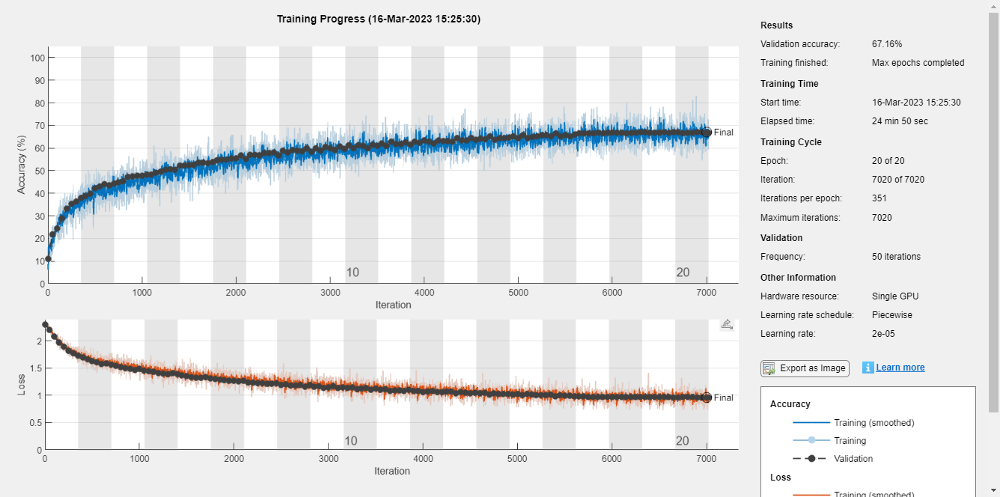


```matlab:Code
preds = improved_net.classify(XTest);
tp = nnz(preds == YTest);
accuracy = tp / length(YTest);
disp(['The network achieved an accuracy of: ', num2str((accuracy)*100), '%'])
```


```text:Output
The network achieved an accuracy of: 66.6%
```


```matlab:Code
confusionchart(YTest,preds)
```


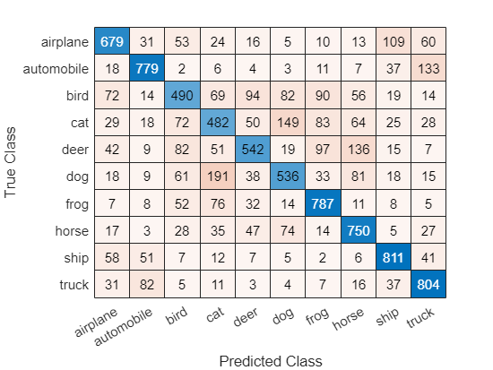


Visualizing incorrectely classified images. Additionally, added a gradCAM visualization to se which parts of an image are important to the classification decision of a network. 


```matlab:Code
indeces = find(preds ~= YTest);
idx = datasample(indeces,4);
subplot(2,2,1);
imshow(XTest(:,:,:,idx(1)));
title([YTest(idx(1)), "mistaken as ", preds(idx(1))])
subplot(2,2,2);
imshow(XTest(:,:,:,idx(2)));
title([YTest(idx(2)), "mistaken as ", preds(idx(2))])
subplot(2,2,3);
imshow(XTest(:,:,:,idx(3)));
title([YTest(idx(3)), "mistaken as ", preds(idx(3))])
subplot(2,2,4);
imshow(XTest(:,:,:,idx(4)));
title([YTest(idx(4)), "mistaken as ", preds(idx(4))])
sgtitle('Wrongly predicted images')
```


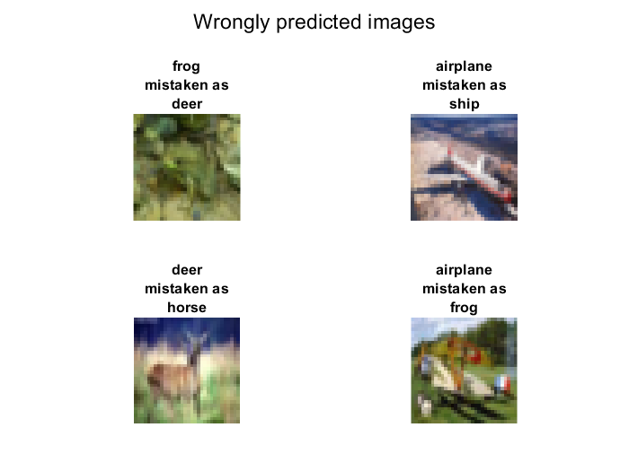


```matlab:Code
scoreMap = gradCAM(improved_net,XTest(:,:,:,idx(1)),YTest(idx(1)));
figure
imagesc(XTest(:,:,:,idx(1)))
hold on
imagesc(scoreMap,'AlphaData',0.5)
colormap jet
title(["GradCAM of", YTest(idx(1))])
hold off
```


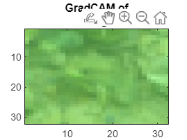


Visualizing correctely classified images. Additionally, added a gradCAM visualization to se which parts of an image are important to the classification decision of a network. 


```matlab:Code
indeces = find(preds == YTest);
idx = datasample(indeces,4);
subplot(2,2,1);
imshow(XTest(:,:,:,idx(1)));
title([YTest(idx(1)), "correctly pred"])
subplot(2,2,2);
imshow(XTest(:,:,:,idx(2)));
title([YTest(idx(2)), "correctly pred"])
subplot(2,2,3);
imshow(XTest(:,:,:,idx(3)));
title([YTest(idx(3)), "correctly pred"])
subplot(2,2,4);
imshow(XTest(:,:,:,idx(4)));
title([YTest(idx(4)), "correctly pred"])
sgtitle('Correctly predicted images')
```


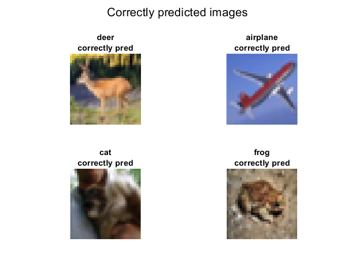


```matlab:Code
scoreMap = gradCAM(improved_net,XTest(:,:,:,idx(1)),YTest(idx(1)));
figure
imagesc(XTest(:,:,:,idx(1)))
hold on
imagesc(scoreMap,'AlphaData',0.5)
colormap jet
title(["GradCAM of", YTest(idx(1))])
hold off
```


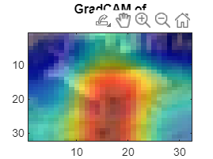

## Ablation Study
### Improved Model (no scheduler)

\hfill \break


```matlab:Code
layers = improved_cnn_classifier_v2();
[X_train, X_val, Y_train, Y_val] = train_test_split(XTrain,YTrain,0.1);
opts = trainingOptions('sgdm', ...
    'Momentum', 0.9, ...
    'InitialLearnRate', 0.0002, ...
    'LearnRateDropFactor', 0.1, ...
    'LearnRateDropPeriod', 16, ...
    'L2Regularization', 0.004, ...
    'ValidationData',{X_val, Y_val}, ...
    'OutputNetwork','best-validation-loss', ...
    'MaxEpochs', 10, ...
    'MiniBatchSize', 128, ...
    'Verbose', true,...
    'Plots','training-progress',...
    'ExecutionEnvironment','gpu');

improved_net = trainNetwork(X_train, Y_train, layers, opts);
```


```text:Output
Initializing input data normalization.
|======================================================================================================================|
|  Epoch  |  Iteration  |  Time Elapsed  |  Mini-batch  |  Validation  |  Mini-batch  |  Validation  |  Base Learning  |
|         |             |   (hh:mm:ss)   |   Accuracy   |   Accuracy   |     Loss     |     Loss     |      Rate       |
|======================================================================================================================|
|       1 |           1 |       00:00:02 |       10.16% |        9.88% |       2.3029 |       2.2995 |          0.0002 |
|       1 |          50 |       00:00:04 |       15.62% |       15.64% |       2.2066 |       2.1967 |          0.0002 |
|       1 |         100 |       00:00:07 |       18.75% |       21.54% |       2.1512 |       2.1287 |          0.0002 |
|       1 |         150 |       00:00:09 |       22.66% |       23.72% |       2.0048 |       2.0665 |          0.0002 |
|       1 |         200 |       00:00:11 |       27.34% |       29.26% |       1.9710 |       1.9983 |          0.0002 |
|       1 |         250 |       00:00:14 |       28.12% |       31.26% |       2.0090 |       1.9310 |          0.0002 |
|       1 |         300 |       00:00:16 |       27.34% |       33.82% |       1.8685 |       1.8692 |          0.0002 |
|       1 |         350 |       00:00:18 |       31.25% |       35.38% |       1.8216 |       1.8069 |          0.0002 |
|       2 |         400 |       00:00:21 |       33.59% |       37.58% |       1.8849 |       1.7559 |          0.0002 |
|       2 |         450 |       00:00:32 |       33.59% |       38.76% |       1.7164 |       1.7208 |          0.0002 |
|       2 |         500 |       00:00:44 |       37.50% |       38.98% |       1.7128 |       1.6907 |          0.0002 |
|       2 |         550 |       00:00:57 |       39.06% |       41.50% |       1.6177 |       1.6502 |          0.0002 |
|       2 |         600 |       00:01:09 |       44.53% |       41.70% |       1.5522 |       1.6286 |          0.0002 |
|       2 |         650 |       00:01:22 |       39.06% |       42.26% |       1.6993 |       1.6004 |          0.0002 |
|       2 |         700 |       00:01:34 |       41.41% |       44.08% |       1.5923 |       1.5729 |          0.0002 |
|       3 |         750 |       00:01:47 |       39.84% |       44.66% |       1.6830 |       1.5546 |          0.0002 |
|       3 |         800 |       00:01:59 |       43.75% |       44.14% |       1.6612 |       1.5440 |          0.0002 |
|       3 |         850 |       00:02:07 |       42.97% |       45.90% |       1.6999 |       1.5290 |          0.0002 |
|       3 |         900 |       00:02:19 |       46.88% |       46.50% |       1.4982 |       1.5054 |          0.0002 |
|       3 |         950 |       00:02:28 |       46.09% |       46.36% |       1.4018 |       1.4974 |          0.0002 |
|       3 |        1000 |       00:02:34 |       46.88% |       47.10% |       1.4164 |       1.4832 |          0.0002 |
|       3 |        1050 |       00:02:45 |       37.50% |       48.56% |       1.6796 |       1.4681 |          0.0002 |
|       4 |        1100 |       00:02:56 |       42.19% |       48.02% |       1.3809 |       1.4598 |          0.0002 |
|       4 |        1150 |       00:03:07 |       43.75% |       48.46% |       1.4445 |       1.4494 |          0.0002 |
|       4 |        1200 |       00:03:20 |       54.69% |       49.44% |       1.3390 |       1.4378 |          0.0002 |
|       4 |        1250 |       00:03:30 |       43.75% |       50.18% |       1.5242 |       1.4178 |          0.0002 |
|       4 |        1300 |       00:03:35 |       39.06% |       50.10% |       1.6340 |       1.4218 |          0.0002 |
|       4 |        1350 |       00:03:46 |       49.22% |       50.60% |       1.4814 |       1.4029 |          0.0002 |
|       4 |        1400 |       00:03:57 |       55.47% |       50.68% |       1.2978 |       1.3930 |          0.0002 |
|       5 |        1450 |       00:04:10 |       43.75% |       50.82% |       1.4908 |       1.3894 |          0.0002 |
|       5 |        1500 |       00:04:20 |       50.78% |       51.40% |       1.3381 |       1.3813 |          0.0002 |
|       5 |        1550 |       00:04:25 |       49.22% |       51.86% |       1.4804 |       1.3624 |          0.0002 |
|       5 |        1600 |       00:04:36 |       55.47% |       52.90% |       1.3527 |       1.3490 |          0.0002 |
|       5 |        1650 |       00:04:47 |       45.31% |       52.90% |       1.5926 |       1.3513 |          0.0002 |
|       5 |        1700 |       00:05:00 |       47.66% |       52.90% |       1.5307 |       1.3373 |          0.0002 |
|       5 |        1750 |       00:05:12 |       50.78% |       53.54% |       1.3210 |       1.3226 |          0.0002 |
|       6 |        1800 |       00:05:29 |       54.69% |       53.56% |       1.2105 |       1.3253 |          0.0002 |
|       6 |        1850 |       00:05:42 |       51.56% |       54.06% |       1.4496 |       1.3097 |          0.0002 |
|       6 |        1900 |       00:05:46 |       58.59% |       53.92% |       1.1564 |       1.3122 |          0.0002 |
|       6 |        1950 |       00:05:55 |       63.28% |       55.20% |       1.1233 |       1.2822 |          0.0002 |
|       6 |        2000 |       00:06:05 |       57.81% |       55.30% |       1.2360 |       1.2887 |          0.0002 |
|       6 |        2050 |       00:06:16 |       49.22% |       55.70% |       1.4211 |       1.2718 |          0.0002 |
|       6 |        2100 |       00:06:28 |       58.59% |       56.40% |       1.2263 |       1.2569 |          0.0002 |
|       7 |        2150 |       00:06:41 |       53.91% |       55.38% |       1.2807 |       1.2713 |          0.0002 |
|       7 |        2200 |       00:06:53 |       54.69% |       56.26% |       1.2934 |       1.2516 |          0.0002 |
|       7 |        2250 |       00:06:57 |       55.47% |       56.18% |       1.1564 |       1.2516 |          0.0002 |
|       7 |        2300 |       00:07:07 |       51.56% |       56.78% |       1.3398 |       1.2297 |          0.0002 |
|       7 |        2350 |       00:07:19 |       63.28% |       57.28% |       1.1068 |       1.2373 |          0.0002 |
|       7 |        2400 |       00:07:32 |       54.69% |       57.22% |       1.2760 |       1.2229 |          0.0002 |
|       7 |        2450 |       00:07:37 |       49.22% |       57.10% |       1.3548 |       1.2148 |          0.0002 |
|       8 |        2500 |       00:07:45 |       51.56% |       56.32% |       1.2887 |       1.2322 |          0.0002 |
|       8 |        2550 |       00:07:56 |       54.69% |       58.08% |       1.2588 |       1.2087 |          0.0002 |
|       8 |        2600 |       00:08:08 |       57.03% |       58.18% |       1.1149 |       1.2046 |          0.0002 |
|       8 |        2650 |       00:08:20 |       67.97% |       58.36% |       1.0364 |       1.1907 |          0.0002 |
|       8 |        2700 |       00:08:29 |       51.56% |       59.34% |       1.3918 |       1.1859 |          0.0002 |
|       8 |        2750 |       00:08:36 |       60.16% |       58.46% |       1.0756 |       1.1835 |          0.0002 |
|       8 |        2800 |       00:08:47 |       56.25% |       59.42% |       1.3123 |       1.1676 |          0.0002 |
|       9 |        2850 |       00:08:58 |       53.12% |       58.46% |       1.3258 |       1.1874 |          0.0002 |
|       9 |        2900 |       00:09:11 |       50.00% |       58.96% |       1.3275 |       1.1766 |          0.0002 |
|       9 |        2950 |       00:09:21 |       53.91% |       59.52% |       1.3655 |       1.1670 |          0.0002 |
|       9 |        3000 |       00:09:25 |       57.03% |       59.62% |       1.1656 |       1.1616 |          0.0002 |
|       9 |        3050 |       00:09:35 |       60.94% |       60.50% |       1.1793 |       1.1499 |          0.0002 |
|       9 |        3100 |       00:09:46 |       59.38% |       60.24% |       1.1877 |       1.1460 |          0.0002 |
|       9 |        3150 |       00:09:59 |       57.81% |       60.68% |       1.1013 |       1.1354 |          0.0002 |
|      10 |        3200 |       00:10:12 |       50.00% |       59.98% |       1.3266 |       1.1592 |          0.0002 |
|      10 |        3250 |       00:10:20 |       52.34% |       60.14% |       1.3075 |       1.1430 |          0.0002 |
|      10 |        3300 |       00:10:31 |       60.16% |       59.94% |       1.1337 |       1.1454 |          0.0002 |
|      10 |        3350 |       00:10:43 |       55.47% |       60.84% |       1.1251 |       1.1256 |          0.0002 |
|      10 |        3400 |       00:10:56 |       54.69% |       61.38% |       1.2932 |       1.1202 |          0.0002 |
|      10 |        3450 |       00:11:03 |       58.59% |       61.50% |       1.1281 |       1.1141 |          0.0002 |
|      10 |        3500 |       00:11:11 |       60.94% |       61.50% |       1.0964 |       1.1091 |          0.0002 |
|      10 |        3510 |       00:11:14 |       51.56% |       61.46% |       1.1848 |       1.1075 |          0.0002 |
|======================================================================================================================|
Training finished: Max epochs completed.
```


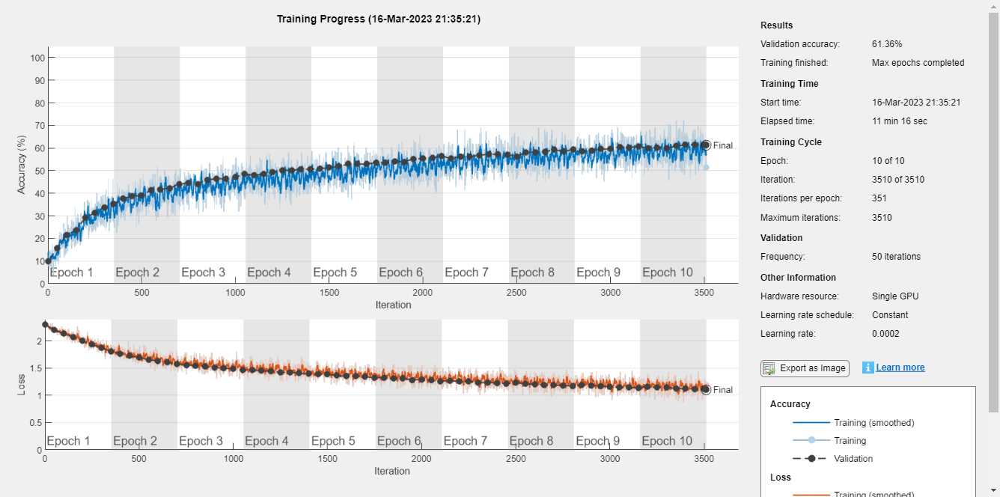


```matlab:Code
preds = improved_net.classify(XTest);
tp = nnz(preds == YTest);
accuracy = tp / length(YTest);
disp(['The network achieved an accuracy of: ', num2str((accuracy)*100), '%'])
```


```text:Output
The network achieved an accuracy of: 60.51%
```


```matlab:Code
confusionchart(YTest,preds)
```


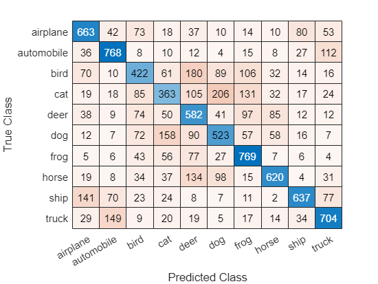


```matlab:Code
indeces = find(preds ~= YTest);
idx = datasample(indeces,2);
subplot(1,2,1);
imshow(XTest(:,:,:,idx(1)));
title([YTest(idx(1)), "mistaken as ", preds(idx(1))])
subplot(1,2,2);
imshow(XTest(:,:,:,idx(2)));
title([YTest(idx(2)), "mistaken as ", preds(idx(2))])
```


### Improved Model (no learn drop factor)

\hfill \break


```matlab:Code
layers = improved_cnn_classifier_v2();
[X_train, X_val, Y_train, Y_val] = train_test_split(XTrain,YTrain,0.1);
opts = trainingOptions('sgdm', ...
    'Momentum', 0.9, ...
    'InitialLearnRate', 0.0002, ...
    'LearnRateSchedule', 'piecewise', ...
    'L2Regularization', 0.004, ...
    'ValidationData',{X_val, Y_val}, ...
    'OutputNetwork','best-validation-loss', ...
    'MaxEpochs', 10, ...
    'MiniBatchSize', 128, ...
    'Verbose', true,...
    'Plots','training-progress',...
    'ExecutionEnvironment','gpu');

improved_net = trainNetwork(X_train, Y_train, layers, opts);
```


```text:Output
Initializing input data normalization.
|======================================================================================================================|
|  Epoch  |  Iteration  |  Time Elapsed  |  Mini-batch  |  Validation  |  Mini-batch  |  Validation  |  Base Learning  |
|         |             |   (hh:mm:ss)   |   Accuracy   |   Accuracy   |     Loss     |     Loss     |      Rate       |
|======================================================================================================================|
|       1 |           1 |       00:00:01 |        5.47% |        9.30% |       2.3046 |       2.3010 |          0.0002 |
|       1 |          50 |       00:00:04 |       11.72% |       11.68% |       2.2648 |       2.2652 |          0.0002 |
|       1 |         100 |       00:00:06 |       15.62% |       19.70% |       2.1902 |       2.2086 |          0.0002 |
|       1 |         150 |       00:00:08 |       21.88% |       26.88% |       2.1346 |       2.1125 |          0.0002 |
|       1 |         200 |       00:00:10 |       30.47% |       30.14% |       2.0314 |       2.0017 |          0.0002 |
|       1 |         250 |       00:00:12 |       28.91% |       33.44% |       1.9836 |       1.9005 |          0.0002 |
|       1 |         300 |       00:00:14 |       35.16% |       34.22% |       1.8816 |       1.8437 |          0.0002 |
|       1 |         350 |       00:00:16 |       36.72% |       36.80% |       1.8632 |       1.7841 |          0.0002 |
|       2 |         400 |       00:00:19 |       32.03% |       38.98% |       1.7880 |       1.7347 |          0.0002 |
|       2 |         450 |       00:00:31 |       39.84% |       40.14% |       1.7234 |       1.7014 |          0.0002 |
|       2 |         500 |       00:00:44 |       34.38% |       41.52% |       1.8204 |       1.6584 |          0.0002 |
|       2 |         550 |       00:00:57 |       44.53% |       42.40% |       1.6165 |       1.6219 |          0.0002 |
|       2 |         600 |       00:01:11 |       33.59% |       43.16% |       1.7913 |       1.5937 |          0.0002 |
|       2 |         650 |       00:01:24 |       49.22% |       43.66% |       1.4407 |       1.5827 |          0.0002 |
|       2 |         700 |       00:01:36 |       38.28% |       44.36% |       1.6472 |       1.5520 |          0.0002 |
|       3 |         750 |       00:01:49 |       37.50% |       45.72% |       1.7627 |       1.5257 |          0.0002 |
|       3 |         800 |       00:01:54 |       54.69% |       45.78% |       1.5343 |       1.5203 |          0.0002 |
|       3 |         850 |       00:02:03 |       46.88% |       47.04% |       1.4858 |       1.4910 |          0.0002 |
|       3 |         900 |       00:02:15 |       37.50% |       47.86% |       1.6260 |       1.4679 |          0.0002 |
|       3 |         950 |       00:02:26 |       41.41% |       47.88% |       1.5693 |       1.4611 |          0.0002 |
|       3 |        1000 |       00:02:30 |       47.66% |       48.86% |       1.4482 |       1.4469 |          0.0002 |
|       3 |        1050 |       00:02:41 |       42.97% |       48.48% |       1.5309 |       1.4364 |          0.0002 |
|       4 |        1100 |       00:02:52 |       51.56% |       50.02% |       1.3590 |       1.4124 |          0.0002 |
|       4 |        1150 |       00:03:04 |       47.66% |       50.88% |       1.4281 |       1.4042 |          0.0002 |
|       4 |        1200 |       00:03:16 |       40.62% |       51.52% |       1.5319 |       1.3735 |          0.0002 |
|       4 |        1250 |       00:03:27 |       45.31% |       51.80% |       1.4253 |       1.3654 |          0.0002 |
|       4 |        1300 |       00:03:31 |       50.78% |       51.92% |       1.3332 |       1.3587 |          0.0002 |
|       4 |        1350 |       00:03:41 |       50.00% |       52.62% |       1.4151 |       1.3482 |          0.0002 |
|       4 |        1400 |       00:03:53 |       51.56% |       52.62% |       1.3399 |       1.3372 |          0.0002 |
|       5 |        1450 |       00:04:05 |       57.03% |       52.38% |       1.2348 |       1.3406 |          0.0002 |
|       5 |        1500 |       00:04:18 |       49.22% |       53.52% |       1.4667 |       1.3232 |          0.0002 |
|       5 |        1550 |       00:04:22 |       56.25% |       54.58% |       1.3136 |       1.2959 |          0.0002 |
|       5 |        1600 |       00:04:33 |       46.88% |       54.60% |       1.3205 |       1.2832 |          0.0002 |
|       5 |        1650 |       00:04:44 |       50.00% |       54.92% |       1.3731 |       1.2859 |          0.0002 |
|       5 |        1700 |       00:04:57 |       51.56% |       54.24% |       1.2684 |       1.2843 |          0.0002 |
|       5 |        1750 |       00:05:08 |       60.16% |       55.48% |       1.2204 |       1.2608 |          0.0002 |
|       6 |        1800 |       00:05:12 |       45.31% |       54.86% |       1.4445 |       1.2656 |          0.0002 |
|       6 |        1850 |       00:05:23 |       55.47% |       55.16% |       1.2591 |       1.2682 |          0.0002 |
|       6 |        1900 |       00:05:34 |       55.47% |       56.44% |       1.2618 |       1.2345 |          0.0002 |
|       6 |        1950 |       00:05:47 |       52.34% |       56.18% |       1.2672 |       1.2334 |          0.0002 |
|       6 |        2000 |       00:05:59 |       55.47% |       56.34% |       1.2474 |       1.2302 |          0.0002 |
|       6 |        2050 |       00:06:04 |       50.78% |       56.10% |       1.2946 |       1.2259 |          0.0002 |
|       6 |        2100 |       00:06:15 |       57.81% |       57.04% |       1.2398 |       1.2123 |          0.0002 |
|       7 |        2150 |       00:06:24 |       53.91% |       56.56% |       1.2002 |       1.2162 |          0.0002 |
|       7 |        2200 |       00:06:29 |       56.25% |       56.98% |       1.1907 |       1.2195 |          0.0002 |
|       7 |        2250 |       00:06:40 |       63.28% |       57.76% |       1.1765 |       1.1892 |          0.0002 |
|       7 |        2300 |       00:06:52 |       58.59% |       57.38% |       1.1153 |       1.1875 |          0.0002 |
|       7 |        2350 |       00:07:16 |       62.50% |       58.62% |       1.1658 |       1.1825 |          0.0002 |
|       7 |        2400 |       00:07:28 |       69.53% |       57.76% |       1.0743 |       1.1827 |          0.0002 |
|       7 |        2450 |       00:07:37 |       63.28% |       58.40% |       1.1288 |       1.1768 |          0.0002 |
|       8 |        2500 |       00:07:48 |       53.91% |       58.04% |       1.3579 |       1.1736 |          0.0002 |
|       8 |        2550 |       00:08:00 |       51.56% |       58.24% |       1.3414 |       1.1810 |          0.0002 |
|       8 |        2600 |       00:08:13 |       56.25% |       58.80% |       1.1395 |       1.1596 |          0.0002 |
|       8 |        2650 |       00:08:23 |       55.47% |       59.18% |       1.1116 |       1.1543 |          0.0002 |
|       8 |        2700 |       00:08:34 |       67.19% |       59.00% |       1.0677 |       1.1517 |          0.0002 |
|       8 |        2750 |       00:08:45 |       59.38% |       59.46% |       1.1239 |       1.1430 |          0.0002 |
|       8 |        2800 |       00:08:58 |       60.16% |       59.58% |       1.1631 |       1.1340 |          0.0002 |
|       9 |        2850 |       00:09:11 |       63.28% |       59.80% |       1.0554 |       1.1366 |          0.0002 |
|       9 |        2900 |       00:09:16 |       49.22% |       59.52% |       1.3414 |       1.1447 |          0.0002 |
|       9 |        2950 |       00:09:25 |       64.06% |       60.36% |       1.0590 |       1.1199 |          0.0002 |
|       9 |        3000 |       00:09:35 |       57.81% |       60.56% |       1.2427 |       1.1213 |          0.0002 |
|       9 |        3050 |       00:09:47 |       60.94% |       59.68% |       1.0922 |       1.1383 |          0.0002 |
|       9 |        3100 |       00:10:00 |       58.59% |       60.48% |       1.0939 |       1.1151 |          0.0002 |
|       9 |        3150 |       00:10:09 |       60.94% |       60.92% |       1.1390 |       1.1047 |          0.0002 |
|      10 |        3200 |       00:10:20 |       60.16% |       60.86% |       1.0939 |       1.1072 |          0.0002 |
|      10 |        3250 |       00:10:31 |       57.03% |       60.68% |       1.1785 |       1.1125 |          0.0002 |
|      10 |        3300 |       00:10:44 |       56.25% |       61.16% |       1.2843 |       1.0893 |          0.0002 |
|      10 |        3350 |       00:10:56 |       60.16% |       61.80% |       1.1766 |       1.0883 |          0.0002 |
|      10 |        3400 |       00:11:04 |       58.59% |       60.76% |       1.2199 |       1.0930 |          0.0002 |
|      10 |        3450 |       00:11:12 |       55.47% |       61.74% |       1.1429 |       1.0831 |          0.0002 |
|      10 |        3500 |       00:11:24 |       50.78% |       61.38% |       1.2923 |       1.0832 |          0.0002 |
|      10 |        3510 |       00:11:28 |       60.16% |       61.56% |       1.1202 |       1.0857 |          0.0002 |
|======================================================================================================================|
Training finished: Max epochs completed.
```


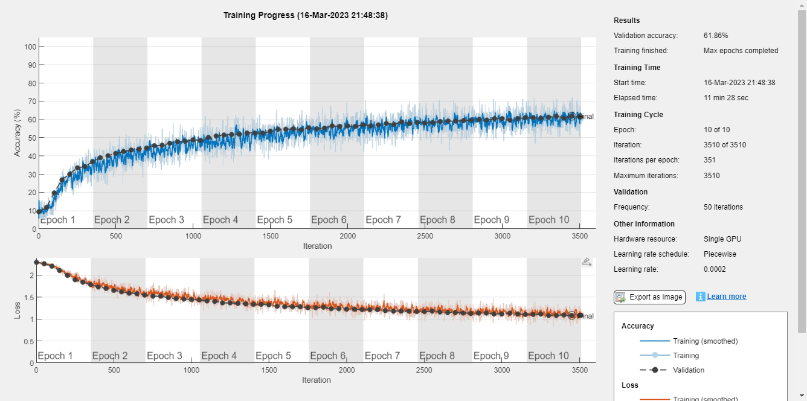


```matlab:Code
preds = improved_net.classify(XTest);
tp = nnz(preds == YTest);
accuracy = tp / length(YTest);
disp(['The network achieved an accuracy of: ', num2str((accuracy)*100), '%'])
```


```text:Output
The network achieved an accuracy of: 62.1%
```


```matlab:Code
confusionchart(YTest,preds)
```


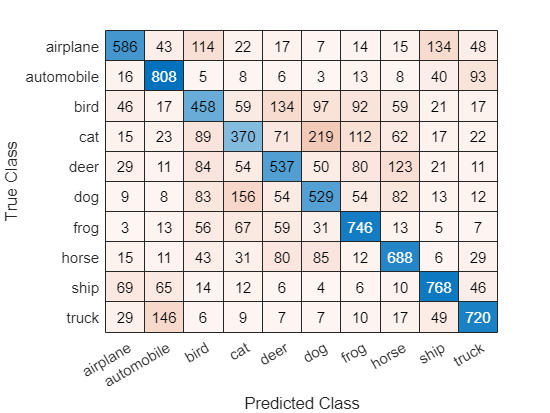


```matlab:Code
indeces = find(preds ~= YTest);
idx = datasample(indeces,2);
subplot(1,2,1);
imshow(XTest(:,:,:,idx(1)));
title([YTest(idx(1)), "mistaken as ", preds(idx(1))])
subplot(1,2,2);
imshow(XTest(:,:,:,idx(2)));
title([YTest(idx(2)), "mistaken as ", preds(idx(2))])
```


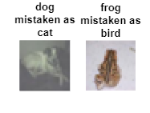

### Improved Model (no l2 regularization)

\hfill \break


```matlab:Code
layers = improved_cnn_classifier_v2();
[X_train, X_val, Y_train, Y_val] = train_test_split(XTrain,YTrain,0.1);
opts = trainingOptions('sgdm', ...
    'Momentum', 0.9, ...
    'InitialLearnRate', 0.0002, ...
    'LearnRateSchedule', 'piecewise', ...
    'LearnRateDropFactor', 0.1, ...
    'LearnRateDropPeriod', 16, ...
    'ValidationData',{X_val, Y_val}, ...
    'OutputNetwork','best-validation-loss', ...
    'MaxEpochs', 10, ...
    'MiniBatchSize', 128, ...
    'Verbose', true,...
    'Plots','training-progress',...
    'ExecutionEnvironment','gpu');

improved_net = trainNetwork(X_train, Y_train, layers, opts);
```


```text:Output
Initializing input data normalization.
|======================================================================================================================|
|  Epoch  |  Iteration  |  Time Elapsed  |  Mini-batch  |  Validation  |  Mini-batch  |  Validation  |  Base Learning  |
|         |             |   (hh:mm:ss)   |   Accuracy   |   Accuracy   |     Loss     |     Loss     |      Rate       |
|======================================================================================================================|
|       1 |           1 |       00:00:04 |        7.81% |        9.58% |       2.3030 |       2.3009 |          0.0002 |
|       1 |          50 |       00:00:16 |       21.88% |       18.68% |       2.1780 |       2.1987 |          0.0002 |
|       1 |         100 |       00:00:29 |       21.88% |       24.12% |       2.0851 |       2.0689 |          0.0002 |
|       1 |         150 |       00:00:41 |       32.03% |       26.98% |       1.9193 |       1.9670 |          0.0002 |
|       1 |         200 |       00:00:53 |       28.12% |       32.44% |       1.8580 |       1.8839 |          0.0002 |
|       1 |         250 |       00:01:06 |       32.81% |       32.48% |       1.8603 |       1.8273 |          0.0002 |
|       1 |         300 |       00:01:18 |       34.38% |       35.98% |       1.8293 |       1.7736 |          0.0002 |
|       1 |         350 |       00:01:28 |       24.22% |       36.70% |       1.8598 |       1.7393 |          0.0002 |
|       2 |         400 |       00:01:34 |       33.59% |       37.20% |       1.7967 |       1.6977 |          0.0002 |
|       2 |         450 |       00:01:45 |       35.94% |       38.84% |       1.7677 |       1.6648 |          0.0002 |
|       2 |         500 |       00:01:58 |       41.41% |       40.68% |       1.6095 |       1.6463 |          0.0002 |
|       2 |         550 |       00:02:05 |       35.16% |       42.66% |       1.6101 |       1.6023 |          0.0002 |
|       2 |         600 |       00:02:13 |       42.19% |       41.46% |       1.5807 |       1.5965 |          0.0002 |
|       2 |         650 |       00:02:24 |       34.38% |       43.62% |       1.6952 |       1.5655 |          0.0002 |
|       2 |         700 |       00:02:35 |       42.97% |       43.44% |       1.5581 |       1.5540 |          0.0002 |
|       3 |         750 |       00:02:48 |       50.00% |       44.28% |       1.4229 |       1.5265 |          0.0002 |
|       3 |         800 |       00:03:00 |       40.62% |       44.78% |       1.5972 |       1.5172 |          0.0002 |
|       3 |         850 |       00:03:09 |       42.19% |       45.94% |       1.5467 |       1.4975 |          0.0002 |
|       3 |         900 |       00:03:20 |       34.38% |       46.72% |       1.7033 |       1.4782 |          0.0002 |
|       3 |         950 |       00:03:32 |       42.19% |       46.88% |       1.6788 |       1.4725 |          0.0002 |
|       3 |        1000 |       00:03:44 |       45.31% |       47.46% |       1.4612 |       1.4552 |          0.0002 |
|       3 |        1050 |       00:03:48 |       42.19% |       48.24% |       1.5250 |       1.4378 |          0.0002 |
|       4 |        1100 |       00:03:59 |       45.31% |       47.80% |       1.4605 |       1.4329 |          0.0002 |
|       4 |        1150 |       00:04:09 |       48.44% |       49.18% |       1.4604 |       1.4185 |          0.0002 |
|       4 |        1200 |       00:04:21 |       42.97% |       49.64% |       1.5428 |       1.3993 |          0.0002 |
|       4 |        1250 |       00:04:33 |       47.66% |       50.22% |       1.5722 |       1.3882 |          0.0002 |
|       4 |        1300 |       00:04:41 |       52.34% |       49.76% |       1.5553 |       1.3820 |          0.0002 |
|       4 |        1350 |       00:04:49 |       50.00% |       50.48% |       1.4848 |       1.3702 |          0.0002 |
|       4 |        1400 |       00:05:02 |       46.09% |       51.56% |       1.3961 |       1.3578 |          0.0002 |
|       5 |        1450 |       00:05:11 |       42.97% |       50.84% |       1.5020 |       1.3549 |          0.0002 |
|       5 |        1500 |       00:05:21 |       47.66% |       51.96% |       1.4143 |       1.3342 |          0.0002 |
|       5 |        1550 |       00:05:32 |       51.56% |       52.84% |       1.2701 |       1.3244 |          0.0002 |
|       5 |        1600 |       00:05:43 |       57.81% |       52.68% |       1.2365 |       1.3152 |          0.0002 |
|       5 |        1650 |       00:05:56 |       55.47% |       52.78% |       1.3370 |       1.3109 |          0.0002 |
|       5 |        1700 |       00:06:08 |       42.19% |       52.92% |       1.4641 |       1.3123 |          0.0002 |
|       5 |        1750 |       00:06:14 |       51.56% |       54.26% |       1.3720 |       1.2828 |          0.0002 |
|       6 |        1800 |       00:06:23 |       53.91% |       53.34% |       1.3344 |       1.2932 |          0.0002 |
|       6 |        1850 |       00:06:33 |       56.25% |       54.32% |       1.2652 |       1.2709 |          0.0002 |
|       6 |        1900 |       00:06:44 |       48.44% |       55.34% |       1.4240 |       1.2663 |          0.0002 |
|       6 |        1950 |       00:06:57 |       50.78% |       55.04% |       1.3767 |       1.2665 |          0.0002 |
|       6 |        2000 |       00:07:09 |       49.22% |       55.12% |       1.3105 |       1.2591 |          0.0002 |
|       6 |        2050 |       00:07:13 |       59.38% |       54.76% |       1.1977 |       1.2651 |          0.0002 |
|       6 |        2100 |       00:07:23 |       51.56% |       55.80% |       1.3038 |       1.2377 |          0.0002 |
|       7 |        2150 |       00:07:34 |       47.66% |       55.18% |       1.2990 |       1.2560 |          0.0002 |
|       7 |        2200 |       00:07:47 |       53.91% |       56.26% |       1.1875 |       1.2298 |          0.0002 |
|       7 |        2250 |       00:07:57 |       57.81% |       56.98% |       1.2901 |       1.2177 |          0.0002 |
|       7 |        2300 |       00:08:08 |       53.91% |       56.84% |       1.2804 |       1.2242 |          0.0002 |
|       7 |        2350 |       00:08:18 |       49.22% |       56.50% |       1.3217 |       1.2110 |          0.0002 |
|       7 |        2400 |       00:08:40 |       57.81% |       56.82% |       1.1468 |       1.2129 |          0.0002 |
|       7 |        2450 |       00:08:51 |       57.03% |       57.50% |       1.1522 |       1.2013 |          0.0002 |
|       8 |        2500 |       00:08:59 |       60.16% |       56.82% |       1.1402 |       1.2200 |          0.0002 |
|       8 |        2550 |       00:09:10 |       55.47% |       57.26% |       1.2748 |       1.1980 |          0.0002 |
|       8 |        2600 |       00:09:22 |       54.69% |       57.94% |       1.3399 |       1.1827 |          0.0002 |
|       8 |        2650 |       00:09:34 |       54.69% |       58.14% |       1.1989 |       1.1900 |          0.0002 |
|       8 |        2700 |       00:09:41 |       57.03% |       57.54% |       1.2778 |       1.1772 |          0.0002 |
|       8 |        2750 |       00:09:47 |       59.38% |       58.16% |       1.1414 |       1.1814 |          0.0002 |
|       8 |        2800 |       00:09:53 |       57.03% |       58.86% |       1.2965 |       1.1641 |          0.0002 |
|       9 |        2850 |       00:09:59 |       57.03% |       57.64% |       1.2931 |       1.1842 |          0.0002 |
|       9 |        2900 |       00:10:11 |       65.62% |       58.78% |       1.1451 |       1.1580 |          0.0002 |
|       9 |        2950 |       00:10:24 |       60.94% |       59.14% |       1.1793 |       1.1474 |          0.0002 |
|       9 |        3000 |       00:10:33 |       60.94% |       59.06% |       1.1929 |       1.1498 |          0.0002 |
|       9 |        3050 |       00:10:40 |       60.94% |       59.70% |       1.2063 |       1.1393 |          0.0002 |
|       9 |        3100 |       00:10:51 |       59.38% |       59.42% |       1.2418 |       1.1377 |          0.0002 |
|       9 |        3150 |       00:11:02 |       60.94% |       59.70% |       1.0703 |       1.1382 |          0.0002 |
|      10 |        3200 |       00:11:15 |       57.03% |       59.50% |       1.2923 |       1.1406 |          0.0002 |
|      10 |        3250 |       00:11:28 |       59.38% |       59.48% |       1.1407 |       1.1397 |          0.0002 |
|      10 |        3300 |       00:11:32 |       62.50% |       60.50% |       1.2098 |       1.1138 |          0.0002 |
|      10 |        3350 |       00:11:43 |       64.06% |       60.12% |       1.1273 |       1.1243 |          0.0002 |
|      10 |        3400 |       00:11:54 |       57.81% |       60.42% |       1.1289 |       1.1166 |          0.0002 |
|      10 |        3450 |       00:12:07 |       64.06% |       60.52% |       1.1046 |       1.1060 |          0.0002 |
|      10 |        3500 |       00:12:19 |       58.59% |       60.62% |       1.1213 |       1.1026 |          0.0002 |
|      10 |        3510 |       00:12:22 |       63.28% |       60.62% |       1.0075 |       1.1043 |          0.0002 |
|======================================================================================================================|
Training finished: Max epochs completed.
```


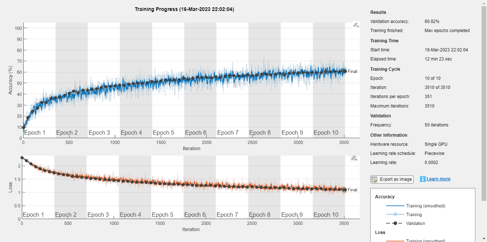


```matlab:Code
preds = improved_net.classify(XTest);
tp = nnz(preds == YTest);
accuracy = tp / length(YTest);
disp(['The network achieved an accuracy of: ', num2str((accuracy)*100), '%'])
```


```text:Output
The network achieved an accuracy of: 61.55%
```


```matlab:Code
confusionchart(YTest,preds)
```


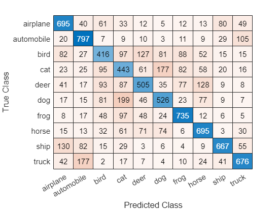


```matlab:Code
indeces = find(preds ~= YTest);
idx = datasample(indeces,2);
subplot(1,2,1);
imshow(XTest(:,:,:,idx(1)));
title([YTest(idx(1)), "mistaken as ", preds(idx(1))])
subplot(1,2,2);
imshow(XTest(:,:,:,idx(2)));
title([YTest(idx(2)), "mistaken as ", preds(idx(2))])
```


### Improved Model (no batch norm)

\hfill \break


```matlab:Code
layers = improved_cnn_classifier_v2();
[X_train, X_val, Y_train, Y_val] = train_test_split(XTrain,YTrain,0.1);
opts = trainingOptions('sgdm', ...
    'Momentum', 0.9, ...
    'InitialLearnRate', 0.0002, ...
    'LearnRateSchedule', 'piecewise', ...
    'LearnRateDropFactor', 0.1, ...
    'LearnRateDropPeriod', 16, ...
    'L2Regularization', 0.004, ...
    'ValidationData',{X_val, Y_val}, ...
    'OutputNetwork','best-validation-loss', ...
    'MaxEpochs', 10, ...
    'MiniBatchSize', 128, ...
    'Verbose', true,...
    'Plots','training-progress',...
    'ExecutionEnvironment','gpu');

improved_net = trainNetwork(X_train, Y_train, layers, opts);
```


```text:Output
Initializing input data normalization.
|======================================================================================================================|
|  Epoch  |  Iteration  |  Time Elapsed  |  Mini-batch  |  Validation  |  Mini-batch  |  Validation  |  Base Learning  |
|         |             |   (hh:mm:ss)   |   Accuracy   |   Accuracy   |     Loss     |     Loss     |      Rate       |
|======================================================================================================================|
|       1 |           1 |       00:00:01 |        6.25% |       11.16% |       2.3075 |       2.3557 |          0.0002 |
|       1 |          50 |       00:00:04 |       18.75% |       20.14% |       2.2579 |       2.1762 |          0.0002 |
|       1 |         100 |       00:00:06 |       14.84% |       23.94% |       2.1735 |       2.0796 |          0.0002 |
|       1 |         150 |       00:00:08 |       19.53% |       30.46% |       2.0732 |       1.9230 |          0.0002 |
|       1 |         200 |       00:00:10 |       26.56% |       33.46% |       1.9690 |       1.8398 |          0.0002 |
|       1 |         250 |       00:00:12 |       32.81% |       36.32% |       1.8535 |       1.7897 |          0.0002 |
|       1 |         300 |       00:00:13 |       33.59% |       35.54% |       1.9281 |       1.7872 |          0.0002 |
|       1 |         350 |       00:00:15 |       35.94% |       37.80% |       1.6470 |       1.6953 |          0.0002 |
|       2 |         400 |       00:00:17 |       35.16% |       38.90% |       1.9126 |       1.6918 |          0.0002 |
|       2 |         450 |       00:00:19 |       36.72% |       38.76% |       1.6476 |       1.6988 |          0.0002 |
|       2 |         500 |       00:00:21 |       35.94% |       41.64% |       1.6485 |       1.6113 |          0.0002 |
|       2 |         550 |       00:00:23 |       38.28% |       41.42% |       1.6813 |       1.6163 |          0.0002 |
|       2 |         600 |       00:00:24 |       39.84% |       42.54% |       1.6528 |       1.5883 |          0.0002 |
|       2 |         650 |       00:00:26 |       47.66% |       44.34% |       1.5899 |       1.5737 |          0.0002 |
|       2 |         700 |       00:00:28 |       43.75% |       43.94% |       1.5567 |       1.5504 |          0.0002 |
|       3 |         750 |       00:00:30 |       44.53% |       45.16% |       1.4013 |       1.5062 |          0.0002 |
|       3 |         800 |       00:00:32 |       41.41% |       44.16% |       1.5716 |       1.5433 |          0.0002 |
|       3 |         850 |       00:00:37 |       39.06% |       46.84% |       1.5624 |       1.4862 |          0.0002 |
|       3 |         900 |       00:00:48 |       44.53% |       45.66% |       1.5801 |       1.5145 |          0.0002 |
|       3 |         950 |       00:00:59 |       50.00% |       46.88% |       1.4357 |       1.4681 |          0.0002 |
|       3 |        1000 |       00:01:11 |       47.66% |       46.40% |       1.4426 |       1.4883 |          0.0002 |
|       3 |        1050 |       00:01:22 |       53.91% |       47.88% |       1.3613 |       1.4458 |          0.0002 |
|       4 |        1100 |       00:01:34 |       42.97% |       49.28% |       1.5337 |       1.3996 |          0.0002 |
|       4 |        1150 |       00:01:46 |       42.97% |       49.60% |       1.6072 |       1.4314 |          0.0002 |
|       4 |        1200 |       00:02:05 |       42.97% |       50.50% |       1.4771 |       1.4011 |          0.0002 |
|       4 |        1250 |       00:02:17 |       42.97% |       49.56% |       1.4667 |       1.4333 |          0.0002 |
|       4 |        1300 |       00:02:28 |       49.22% |       51.00% |       1.4852 |       1.3758 |          0.0002 |
|       4 |        1350 |       00:02:40 |       37.50% |       49.56% |       1.5204 |       1.4272 |          0.0002 |
|       4 |        1400 |       00:02:51 |       52.34% |       51.68% |       1.3499 |       1.3600 |          0.0002 |
|       5 |        1450 |       00:02:58 |       57.03% |       53.08% |       1.2940 |       1.3367 |          0.0002 |
|       5 |        1500 |       00:03:05 |       50.00% |       51.84% |       1.4825 |       1.3562 |          0.0002 |
|       5 |        1550 |       00:03:16 |       60.16% |       53.96% |       1.1128 |       1.3087 |          0.0002 |
|       5 |        1600 |       00:03:27 |       54.69% |       51.62% |       1.3066 |       1.3793 |          0.0002 |
|       5 |        1650 |       00:03:30 |       46.09% |       53.78% |       1.4496 |       1.3066 |          0.0002 |
|       5 |        1700 |       00:03:40 |       54.69% |       53.06% |       1.2523 |       1.3348 |          0.0002 |
|       5 |        1750 |       00:03:50 |       57.81% |       53.38% |       1.1403 |       1.3062 |          0.0002 |
|       6 |        1800 |       00:04:01 |       50.78% |       53.48% |       1.2838 |       1.3031 |          0.0002 |
|       6 |        1850 |       00:04:12 |       50.78% |       54.36% |       1.3883 |       1.3002 |          0.0002 |
|       6 |        1900 |       00:04:24 |       54.69% |       55.08% |       1.1897 |       1.2684 |          0.0002 |
|       6 |        1950 |       00:04:29 |       52.34% |       54.90% |       1.2787 |       1.2841 |          0.0002 |
|       6 |        2000 |       00:04:37 |       52.34% |       54.92% |       1.3593 |       1.2809 |          0.0002 |
|       6 |        2050 |       00:04:48 |       48.44% |       55.56% |       1.4300 |       1.2706 |          0.0002 |
|       6 |        2100 |       00:04:59 |       46.88% |       55.72% |       1.3767 |       1.2449 |          0.0002 |
|       7 |        2150 |       00:05:11 |       52.34% |       56.30% |       1.2569 |       1.2470 |          0.0002 |
|       7 |        2200 |       00:05:19 |       60.94% |       56.32% |       1.1628 |       1.2477 |          0.0002 |
|       7 |        2250 |       00:05:23 |       59.38% |       56.34% |       1.1481 |       1.2325 |          0.0002 |
|       7 |        2300 |       00:05:33 |       50.78% |       56.54% |       1.3606 |       1.2333 |          0.0002 |
|       7 |        2350 |       00:05:44 |       56.25% |       56.82% |       1.2481 |       1.2432 |          0.0002 |
|       7 |        2400 |       00:05:55 |       53.12% |       57.30% |       1.3501 |       1.2230 |          0.0002 |
|       7 |        2450 |       00:06:07 |       57.03% |       57.90% |       1.1319 |       1.2009 |          0.0002 |
|       8 |        2500 |       00:06:13 |       48.44% |       57.90% |       1.3248 |       1.2172 |          0.0002 |
|       8 |        2550 |       00:06:20 |       52.34% |       55.66% |       1.2946 |       1.2461 |          0.0002 |
|       8 |        2600 |       00:06:31 |       54.69% |       58.26% |       1.2391 |       1.1985 |          0.0002 |
|       8 |        2650 |       00:06:42 |       53.12% |       57.34% |       1.1843 |       1.2153 |          0.0002 |
|       8 |        2700 |       00:06:53 |       57.03% |       58.46% |       1.0874 |       1.1869 |          0.0002 |
|       8 |        2750 |       00:06:57 |       53.12% |       57.14% |       1.2639 |       1.2189 |          0.0002 |
|       8 |        2800 |       00:07:07 |       58.59% |       58.72% |       1.1838 |       1.1813 |          0.0002 |
|       9 |        2850 |       00:07:17 |       59.38% |       57.18% |       1.1184 |       1.2475 |          0.0002 |
|       9 |        2900 |       00:07:28 |       62.50% |       57.66% |       1.1482 |       1.2133 |          0.0002 |
|       9 |        2950 |       00:07:40 |       58.59% |       58.90% |       1.1259 |       1.1693 |          0.0002 |
|       9 |        3000 |       00:07:51 |       59.38% |       59.66% |       1.0206 |       1.1660 |          0.0002 |
|       9 |        3050 |       00:07:57 |       56.25% |       59.08% |       1.2536 |       1.1661 |          0.0002 |
|       9 |        3100 |       00:08:00 |       57.03% |       59.58% |       1.2822 |       1.1696 |          0.0002 |
|       9 |        3150 |       00:08:10 |       56.25% |       59.80% |       1.2216 |       1.1544 |          0.0002 |
|      10 |        3200 |       00:08:22 |       53.91% |       60.38% |       1.2771 |       1.1587 |          0.0002 |
|      10 |        3250 |       00:08:34 |       56.25% |       59.38% |       1.1594 |       1.1731 |          0.0002 |
|      10 |        3300 |       00:08:40 |       64.06% |       60.78% |       1.0391 |       1.1387 |          0.0002 |
|      10 |        3350 |       00:08:48 |       68.75% |       60.46% |       1.0628 |       1.1477 |          0.0002 |
|      10 |        3400 |       00:08:58 |       63.28% |       59.94% |       1.0988 |       1.1585 |          0.0002 |
|      10 |        3450 |       00:09:09 |       64.06% |       60.60% |       1.1733 |       1.1425 |          0.0002 |
|      10 |        3500 |       00:09:21 |       60.94% |       60.74% |       1.0634 |       1.1355 |          0.0002 |
|      10 |        3510 |       00:09:24 |       57.03% |       60.10% |       1.2757 |       1.1571 |          0.0002 |
|======================================================================================================================|
Training finished: Max epochs completed.
```


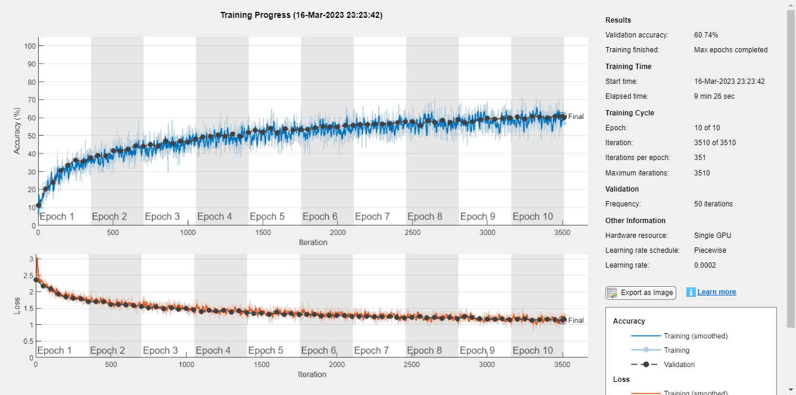


```matlab:Code
preds = improved_net.classify(XTest);
tp = nnz(preds == YTest);
accuracy = tp / length(YTest);
disp(['The network achieved an accuracy of: ', num2str((accuracy)*100), '%'])
```


```text:Output
The network achieved an accuracy of: 60.65%
```


```matlab:Code
confusionchart(YTest,preds)
```


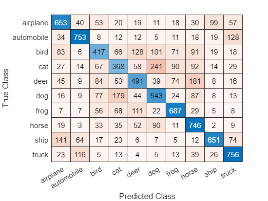


```matlab:Code
indeces = find(preds ~= YTest);
idx = datasample(indeces,2);
subplot(1,2,1);
imshow(XTest(:,:,:,idx(1)));
title([YTest(idx(1)), "mistaken as ", preds(idx(1))])
subplot(1,2,2);
imshow(XTest(:,:,:,idx(2)));
title([YTest(idx(2)), "mistaken as ", preds(idx(2))])
```


### Improved Model (no drop out)

\hfill \break


```matlab:Code
layers = improved_cnn_classifier_v2();
[X_train, X_val, Y_train, Y_val] = train_test_split(XTrain,YTrain,0.1);
opts = trainingOptions('sgdm', ...
    'Momentum', 0.9, ...
    'InitialLearnRate', 0.0002, ...
    'LearnRateSchedule', 'piecewise', ...
    'LearnRateDropFactor', 0.1, ...
    'LearnRateDropPeriod', 16, ...
    'L2Regularization', 0.004, ...
    'ValidationData',{X_val, Y_val}, ...
    'OutputNetwork','best-validation-loss', ...
    'MaxEpochs', 10, ...
    'MiniBatchSize', 128, ...
    'Verbose', true,...
    'Plots','training-progress',...
    'ExecutionEnvironment','gpu');

improved_net = trainNetwork(X_train, Y_train, layers, opts);
```


```text:Output
Initializing input data normalization.
|======================================================================================================================|
|  Epoch  |  Iteration  |  Time Elapsed  |  Mini-batch  |  Validation  |  Mini-batch  |  Validation  |  Base Learning  |
|         |             |   (hh:mm:ss)   |   Accuracy   |   Accuracy   |     Loss     |     Loss     |      Rate       |
|======================================================================================================================|
|       1 |           1 |       00:00:02 |        3.91% |       14.02% |       2.3033 |       2.3016 |          0.0002 |
|       1 |          50 |       00:00:05 |       21.09% |       18.82% |       2.2298 |       2.2252 |          0.0002 |
|       1 |         100 |       00:00:07 |       27.34% |       25.58% |       2.1076 |       2.1120 |          0.0002 |
|       1 |         150 |       00:00:09 |       26.56% |       29.04% |       2.0331 |       2.0245 |          0.0002 |
|       1 |         200 |       00:00:11 |       33.59% |       30.92% |       1.9560 |       1.9508 |          0.0002 |
|       1 |         250 |       00:00:15 |       27.34% |       33.78% |       1.9005 |       1.8754 |          0.0002 |
|       1 |         300 |       00:00:27 |       32.03% |       34.22% |       1.8445 |       1.8200 |          0.0002 |
|       1 |         350 |       00:00:40 |       40.62% |       36.64% |       1.6747 |       1.7567 |          0.0002 |
|       2 |         400 |       00:00:52 |       41.41% |       38.44% |       1.6336 |       1.7108 |          0.0002 |
|       2 |         450 |       00:01:04 |       41.41% |       39.84% |       1.6452 |       1.6673 |          0.0002 |
|       2 |         500 |       00:01:17 |       45.31% |       39.90% |       1.5302 |       1.6470 |          0.0002 |
|       2 |         550 |       00:01:29 |       37.50% |       41.34% |       1.6213 |       1.6014 |          0.0002 |
|       2 |         600 |       00:01:40 |       53.12% |       43.68% |       1.5016 |       1.5685 |          0.0002 |
|       2 |         650 |       00:01:45 |       48.44% |       43.52% |       1.4545 |       1.5503 |          0.0002 |
|       2 |         700 |       00:01:56 |       50.78% |       45.10% |       1.5267 |       1.5255 |          0.0002 |
|       3 |         750 |       00:02:07 |       56.25% |       46.52% |       1.3169 |       1.5013 |          0.0002 |
|       3 |         800 |       00:02:20 |       43.75% |       46.52% |       1.5220 |       1.4936 |          0.0002 |
|       3 |         850 |       00:02:29 |       49.22% |       46.20% |       1.4832 |       1.4827 |          0.0002 |
|       3 |         900 |       00:02:34 |       48.44% |       47.86% |       1.5084 |       1.4433 |          0.0002 |
|       3 |         950 |       00:02:45 |       46.09% |       49.12% |       1.4342 |       1.4287 |          0.0002 |
|       3 |        1000 |       00:02:56 |       50.78% |       49.02% |       1.3027 |       1.4190 |          0.0002 |
|       3 |        1050 |       00:03:08 |       46.09% |       48.88% |       1.3829 |       1.4190 |          0.0002 |
|       4 |        1100 |       00:03:21 |       51.56% |       50.08% |       1.4366 |       1.3954 |          0.0002 |
|       4 |        1150 |       00:03:29 |       57.81% |       49.86% |       1.3599 |       1.3985 |          0.0002 |
|       4 |        1200 |       00:03:38 |       49.22% |       49.28% |       1.4047 |       1.3937 |          0.0002 |
|       4 |        1250 |       00:03:42 |       51.56% |       51.30% |       1.2784 |       1.3567 |          0.0002 |
|       4 |        1300 |       00:03:54 |       51.56% |       52.04% |       1.3441 |       1.3401 |          0.0002 |
|       4 |        1350 |       00:04:07 |       47.66% |       51.68% |       1.4350 |       1.3432 |          0.0002 |
|       4 |        1400 |       00:04:12 |       55.47% |       50.96% |       1.2733 |       1.3465 |          0.0002 |
|       5 |        1450 |       00:04:20 |       56.25% |       52.56% |       1.2118 |       1.3241 |          0.0002 |
|       5 |        1500 |       00:04:28 |       53.91% |       52.34% |       1.2902 |       1.3295 |          0.0002 |
|       5 |        1550 |       00:04:39 |       53.91% |       52.40% |       1.4895 |       1.3272 |          0.0002 |
|       5 |        1600 |       00:04:52 |       51.56% |       54.04% |       1.3830 |       1.2965 |          0.0002 |
|       5 |        1650 |       00:05:03 |       54.69% |       54.42% |       1.2894 |       1.2775 |          0.0002 |
|       5 |        1700 |       00:05:07 |       56.25% |       54.40% |       1.1790 |       1.2882 |          0.0002 |
|       5 |        1750 |       00:05:18 |       57.03% |       53.76% |       1.2924 |       1.2815 |          0.0002 |
|       6 |        1800 |       00:05:29 |       54.69% |       54.98% |       1.1846 |       1.2627 |          0.0002 |
|       6 |        1850 |       00:05:41 |       58.59% |       54.82% |       1.2304 |       1.2689 |          0.0002 |
|       6 |        1900 |       00:05:55 |       55.47% |       54.88% |       1.3761 |       1.2676 |          0.0002 |
|       6 |        1950 |       00:06:14 |       57.03% |       55.98% |       1.2632 |       1.2446 |          0.0002 |
|       6 |        2000 |       00:06:27 |       51.56% |       56.88% |       1.3202 |       1.2258 |          0.0002 |
|       6 |        2050 |       00:06:31 |       53.12% |       55.88% |       1.3973 |       1.2411 |          0.0002 |
|       6 |        2100 |       00:06:41 |       56.25% |       56.38% |       1.1721 |       1.2253 |          0.0002 |
|       7 |        2150 |       00:06:52 |       56.25% |       57.28% |       1.2272 |       1.2102 |          0.0002 |
|       7 |        2200 |       00:07:03 |       61.72% |       56.66% |       1.1222 |       1.2161 |          0.0002 |
|       7 |        2250 |       00:07:15 |       56.25% |       56.52% |       1.3179 |       1.2188 |          0.0002 |
|       7 |        2300 |       00:07:28 |       61.72% |       57.78% |       1.0809 |       1.1988 |          0.0002 |
|       7 |        2350 |       00:07:38 |       59.38% |       58.08% |       1.1253 |       1.1863 |          0.0002 |
|       7 |        2400 |       00:07:43 |       62.50% |       57.62% |       1.0924 |       1.1984 |          0.0002 |
|       7 |        2450 |       00:07:54 |       55.47% |       58.04% |       1.1794 |       1.1794 |          0.0002 |
|       8 |        2500 |       00:08:06 |       60.16% |       58.86% |       1.2203 |       1.1732 |          0.0002 |
|       8 |        2550 |       00:08:19 |       51.56% |       58.30% |       1.1975 |       1.1804 |          0.0002 |
|       8 |        2600 |       00:08:24 |       65.62% |       58.40% |       0.8951 |       1.1792 |          0.0002 |
|       8 |        2650 |       00:08:36 |       61.72% |       59.14% |       1.0675 |       1.1574 |          0.0002 |
|       8 |        2700 |       00:08:48 |       64.84% |       59.14% |       0.9809 |       1.1535 |          0.0002 |
|       8 |        2750 |       00:08:54 |       62.50% |       58.94% |       1.1299 |       1.1698 |          0.0002 |
|       8 |        2800 |       00:09:03 |       60.94% |       59.84% |       1.1131 |       1.1388 |          0.0002 |
|       9 |        2850 |       00:09:14 |       61.72% |       59.80% |       1.1528 |       1.1432 |          0.0002 |
|       9 |        2900 |       00:09:26 |       63.28% |       59.08% |       1.0841 |       1.1486 |          0.0002 |
|       9 |        2950 |       00:09:38 |       60.94% |       59.40% |       1.1012 |       1.1431 |          0.0002 |
|       9 |        3000 |       00:09:51 |       67.19% |       60.64% |       1.0608 |       1.1209 |          0.0002 |
|       9 |        3050 |       00:09:55 |       64.84% |       60.76% |       1.1631 |       1.1199 |          0.0002 |
|       9 |        3100 |       00:10:06 |       61.72% |       60.02% |       1.0565 |       1.1361 |          0.0002 |
|       9 |        3150 |       00:10:17 |       66.41% |       61.22% |       0.9303 |       1.1064 |          0.0002 |
|      10 |        3200 |       00:10:30 |       70.31% |       61.16% |       1.0211 |       1.1133 |          0.0002 |
|      10 |        3250 |       00:10:39 |       71.09% |       60.74% |       0.9166 |       1.1148 |          0.0002 |
|      10 |        3300 |       00:10:47 |       65.62% |       60.58% |       1.0136 |       1.1099 |          0.0002 |
|      10 |        3350 |       00:10:58 |       65.62% |       61.84% |       1.1573 |       1.0937 |          0.0002 |
|      10 |        3400 |       00:11:10 |       63.28% |       61.80% |       1.0498 |       1.0901 |          0.0002 |
|      10 |        3450 |       00:11:22 |       64.06% |       61.06% |       1.1079 |       1.1049 |          0.0002 |
|      10 |        3500 |       00:11:35 |       64.84% |       62.44% |       0.9383 |       1.0787 |          0.0002 |
|      10 |        3510 |       00:11:36 |       63.28% |       61.56% |       1.0266 |       1.0818 |          0.0002 |
|======================================================================================================================|
Training finished: Max epochs completed.
```


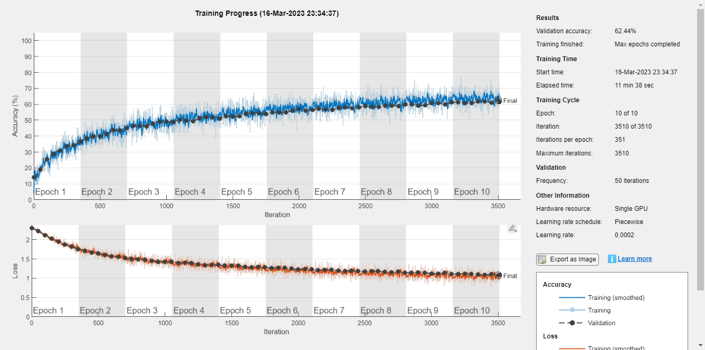


```matlab:Code
preds = improved_net.classify(XTest);
tp = nnz(preds == YTest);
accuracy = tp / length(YTest);
disp(['The network achieved an accuracy of: ', num2str((accuracy)*100), '%'])
```


```text:Output
The network achieved an accuracy of: 62.48%
```


```matlab:Code
confusionchart(YTest,preds)
```


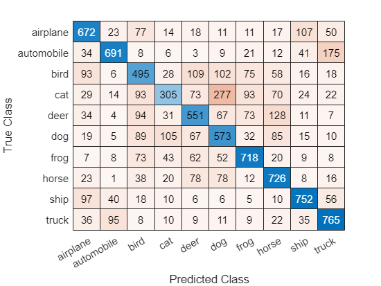


```text:Output
idx = 2x1    
        6348
        4501

```


```matlab:Code
indeces = find(preds ~= YTest);
idx = datasample(indeces,2);
subplot(1,2,1);
imshow(XTest(:,:,:,idx(1)));
title([YTest(idx(1)), "mistaken as ", preds(idx(1))])
subplot(1,2,2);
imshow(XTest(:,:,:,idx(2)));
title([YTest(idx(2)), "mistaken as ", preds(idx(2))])
```

# Advanced Part Project 1
# Miscellaneous


Adding paths and loading `.mat` files as well as importing the CIFAR10 dataset.


```matlab:Code
addpath('./functions');
addpath('./data');
```


```matlab:Code
load('bignet.mat')
load('ood_detection.mat')
[XTrain, YTrain, XTest, YTest] = load_data('data');
```

## Analyzing the network


Here I analyze the network to see which layers it is composed of.


```matlab:Code
analyzeNetwork(bignet)
```

## Feature Extraction


Here, I extract the features using the `activations function and set a threshold base on the feature distribution. Later, I classify the images using this threshold and compute the accuracy.`


```matlab:Code
layer = "relu_10"
```


```text:Output
layer = "relu_10"
```


```matlab:Code
features = activations(bignet, ood_detection.data, layer, OutputAs="rows");
histogram(mean(features,2), NumBins=300)
threshold = 0.32;
xline(threshold,"r-",join(["Threshold" threshold]))
```


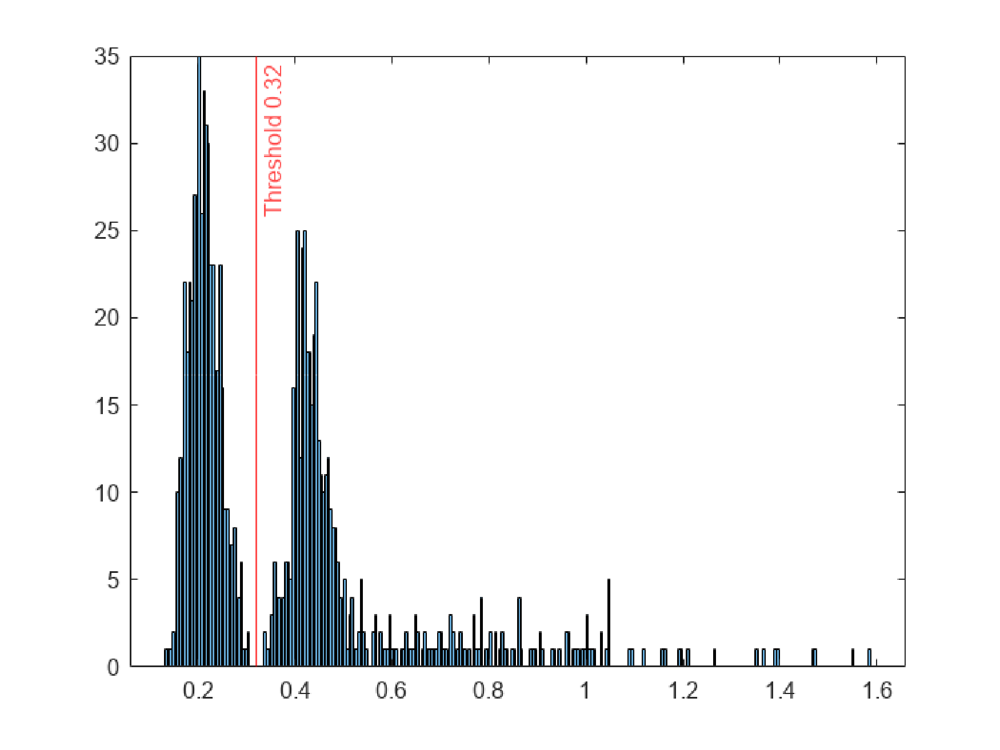


```matlab:Code
pred = mean(features,2)<threshold;
y_test = ood_detection.labels== 'ood';
tp = nnz(pred == y_test);
accuracy = tp / length(y_test);
disp(['The network achieved an accuracy of: ', num2str((accuracy)*100), '%'])
```


```text:Output
The network achieved an accuracy of: 100%
```

## Plotting the images


Here I plot a subset of the id and ood images and compare them side by side.


```matlab:Code
ood = find(ood_detection.labels=='ood');
id = find(ood_detection.labels=='id');
figure;
subplot(1,2,1);
imshow(ood_detection.data(:,:,:,datasample(ood,1)));
title("ood")
subplot(1,2,2);
imshow(ood_detection.data(:,:,:,datasample(id,1)));
title("id")
```


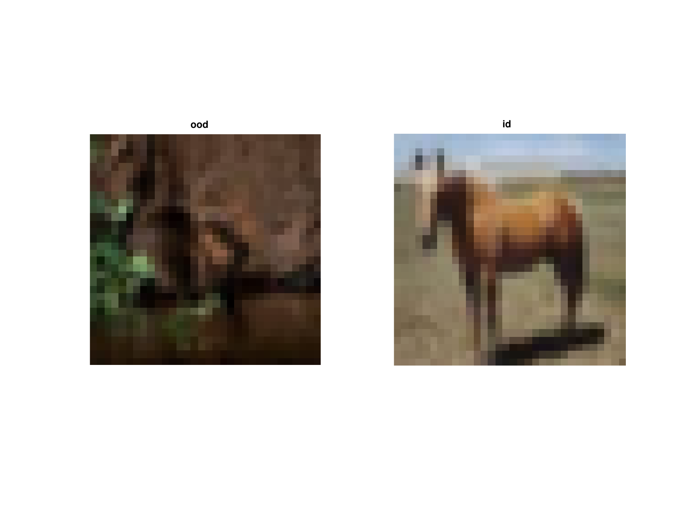

## Empirical Study


I try to use a differnt layer with a lower (still high) accuracy and check which images get confused as id/ood.


```matlab:Code
layer = "relu_9"
```


```text:Output
layer = "relu_9"
```


```matlab:Code
features = activations(bignet, ood_detection.data, layer, OutputAs="rows");
figure;
histogram(mean(features,2), NumBins=300)
threshold = 0.3;
xline(threshold,"r-",join(["Threshold" threshold]))
```


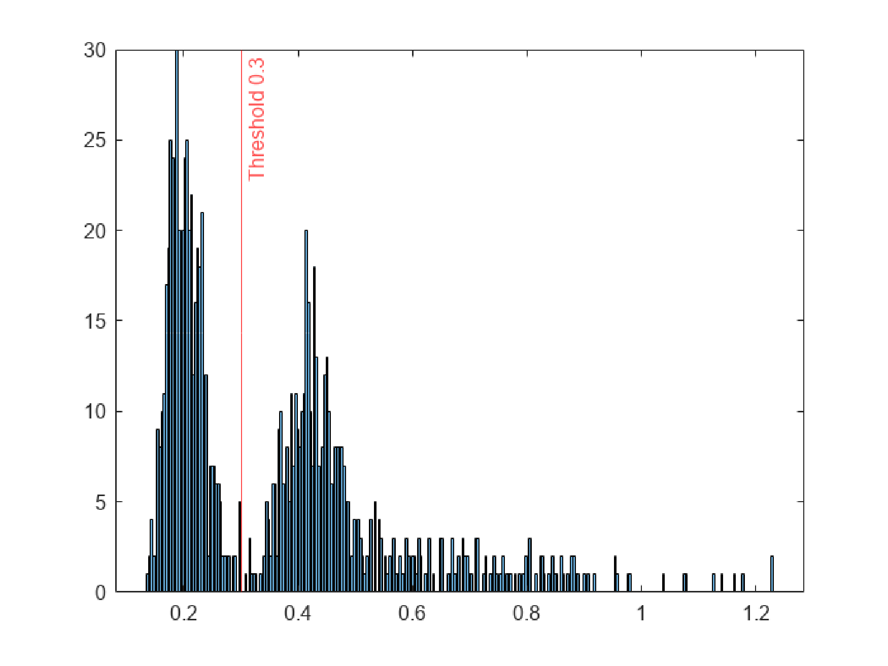


```matlab:Code
pred = mean(features,2)<threshold;
y_test = ood_detection.labels== 'ood';
tp = nnz(pred == y_test);
accuracy = tp / length(y_test);
disp(['The network achieved an accuracy of: ', num2str((accuracy)*100), '%'])
```


```text:Output
The network achieved an accuracy of: 99.3%
```


```matlab:Code
indeces = find(pred ~= y_test)
```


```text:Output
indeces = 7x1    
    84
   306
   510
   618
   707
   882
   884

```


```matlab:Code
ood = find(ood_detection.labels=='ood');
id = find(ood_detection.labels=='id');
wrong_ood = intersect(ood,indeces);
wrong_id = intersect(id,indeces);
figure;
subplot(1,2,1);
idx = datasample(wrong_ood,1);
imagesc(ood_detection.data(:,:,:,idx));
idx = datasample(wrong_ood,1);
subplot(1,2,2);
imagesc(ood_detection.data(:,:,:,idx));
sgtitle("Wrongly classified ood images")
```


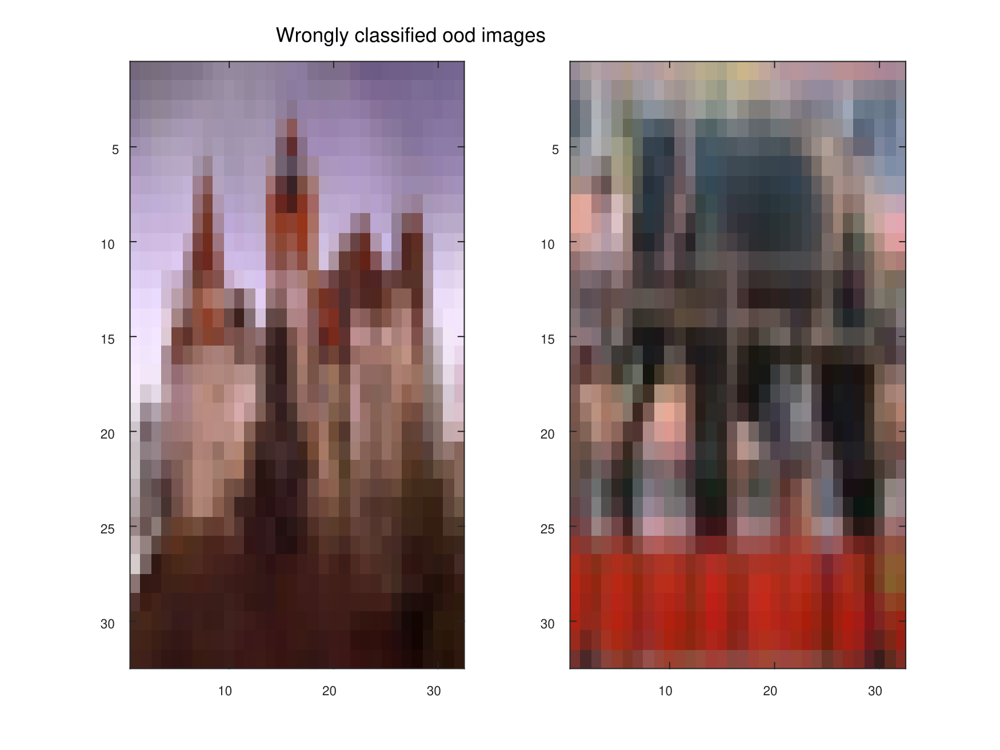


```matlab:Code

```

